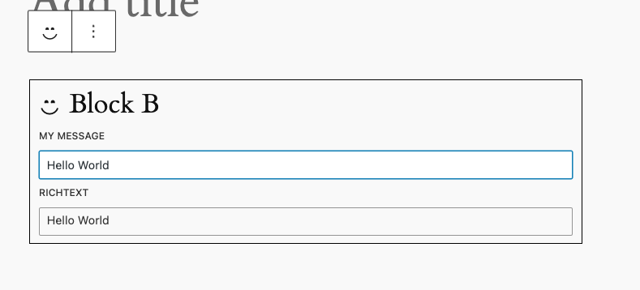
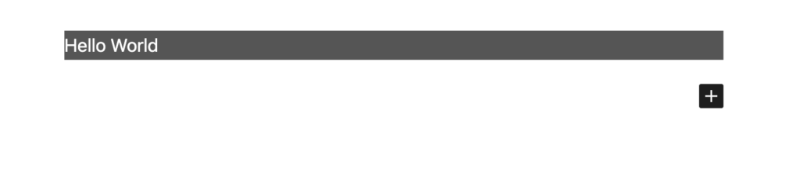

export const metadata = {
	title: "React Components to Blocks",
	description:
		"Create blocks in your Next.js app that also work in the WordPress Block Editor.",
};

The `@faustwp/block-editor-utils` package provides helper functions for converting React components into blocks. This means you can use the same components in both places—your Next.js app and the WordPress Block Editor.

## Prerequisites

In order to use this feature, you need to clone down the working boilerplate example [here](https://github.com/wpengine/faustjs/tree/canary/examples/next/block-support) and follow its instructions in the `README.md` file on what plugins you need, packages you need to install and the command that needs to be run to sync the blocks to WordPress.

> [!WARNING]
> This feature does not work with the latest version of React. It only works with React 18.
> Also, please avoid using this feature in production. It is not fully maintained.

## Creating and Registering a Block Component

In the `pages/wp-blocks/block-b/Component.js` file, you will see the following code:

```js title="pages/wp-blocks/block-b/Component.js"
import { gql } from "@apollo/client";

function Component({ style, attributes, children, ...props }) {
	const styles = {
		...style,
	};
	const cssClassName = "create-block-block-b-message";
	return (
		<>
			<div
				style={styles}
				className={cssClassName}
				dangerouslySetInnerHTML={{ __html: attributes.message }}
			/>
			<div
				style={styles}
				className="rich-text"
				dangerouslySetInnerHTML={{ __html: attributes.richText }}
			/>
		</>
	);
}

Component.fragments = {
	key: `CreateBlockBlockBFragment`,
	entry: gql`
		fragment CreateBlockBlockBFragment on CreateBlockBlockB {
			attributes {
				message
			}
		}
	`,
};

Component.config = {
	name: "CreateBlockBlockB",
	editorFields: {
		message: {
			type: "string",
			label: "My Message",
			location: "editor",
		},
	},
};
export default Component;
```

This defines a React component that renders two `<div>` elements with inline styles and specific CSS class names, inserting `HTML` content from the `attributes` prop using `dangerouslySetInnerHTML`.

It also specifies a GraphQL fragment to fetch the necessary data for the component, particularly the message attribute, ensuring the data structure is aligned with the expected GraphQL type. Additionally, the component includes a configuration object that defines its name and editor fields, which is used to integrate and manage the block within a WordPress block editor environment.

Within your `block-b/index.js` file, we see the following code:

```js title="block-b/index.js"
import { registerFaustBlock } from "@faustwp/block-editor-utils";
import "./style.scss";
import BlockB from "./Component.js";
/**
 * Block.json metadata
 */
import metadata from "./block.json";
/**
 * Register React block on the Block Editor
 */
registerFaustBlock(BlockB, {
	blockJson: metadata,
});
```

This file imports the necessary styling, component logic, and metadata to register a React block with the WordPress block editor using the Faust.js framework. It leverages the `registerFaustBlock` utility from the `@faustwp/block-editor-utils` package, passing the component and its configuration metadata to properly initialize the block.

As a result, the block is seamlessly integrated into the editor, with its visual and functional properties defined by the imported SCSS and JSON metadata.

Now let's take a look at the `block.json` file in the `block-b` folder. Since we declared three configurable attributes for our component, we need to declare them as attributes here.

Here is the final `block.json` with the assigned attributes object:

```json
{
	"$schema": "https://schemas.wp.org/trunk/block.json",
	"apiVersion": 2,
	"name": "create-block/block-b",
	"version": "0.1.0",
	"title": "Block B",
	"category": "widgets",
	"icon": "smiley",
	"description": "Example static block scaffolded with Create Block tool.",
	"supports": {
		"html": false
	},
	"attributes": {
		"message": {
			"type": "string",
			"default": "Hello World"
		},
		"richText": {
			"type": "string",
			"source": "html",
			"selector": ".rich-text",
			"default": "Hello World"
		}
	},
	"textdomain": "block-b",
	"editorScript": "file:./index.js",
	"editorStyle": "file:./index.css",
	"style": "file:./style-index.css"
}
```

## Try out the Component in the Block Editor

Open the WordPress Block Editor and try out the new block. This is what it will look like at first glance in Edit mode:



You can interact with the form fields, and then click outside the block contents where you will see the component rendered in Preview mode.



## Configure the Form Controls

So far we've been able to render the React component in the Block Editor.

However, a few of the attributes that control the color are using [text field](https://developer.wordpress.org/block-editor/reference-guides/components/text-control/) controls, which may prove problematic since they allow invalid values. What if we wanted to use a proper color picker component?

Since the `block.json` [attribute types](https://developer.wordpress.org/block-editor/reference-guides/block-api/block-attributes/#type-validation) do not allow `color` as a value, we will have to provide a different configuration to allow that option.

When registering the React component using `registerFaustBlock`, it allows extra configuration to be used in case you want to declare which kinds of controls to use on each attribute.

In your `Component.js` file, add the following `editorFields` to your `Component.config` object:

```js title="block-b/Component.js"
...
Component.config = {
    name: "CreateBlockBlockB",
    editorFields: {// [!code ++]
        bg_color: {// [!code ++]
            location: "inspector",// [!code ++]
            control: "color",// [!code ++]
        },// [!code ++]
        text_color: {// [!code ++]
            location: "inspector",// [!code ++]
            control: "color",// [!code ++]
        },// [!code ++]
    },// [!code ++]
};
```

`editorFields` represents Block Editor metadata configuration data. This consists of two attributes that we want to specify: the type of control to use and the location within the editor. For example, by using `location: "inspector",` we are telling this control to appear in the [Block Sidebar](https://developer.wordpress.org/block-editor/how-to-guides/block-tutorial/block-controls-toolbar-and-sidebar/) section. By using `control: "color"`, we are indicating that we want to use a [ColorPicker](https://developer.wordpress.org/block-editor/reference-guides/components/color-picker/) component instead of the regular `TextControl`.

Once you update the component, you can refresh the page and create a new block. Now instead of having two text fields inside the block, we have two `ColorPicker` fields in the sidebar section:


## Form Control Reference List

So far we've seen examples of two controls: The `ColorPicker` handled by the `control: "color"` and the `TextControl`, which is set as default for every `type: "string"` in the `block.json` attributes list. You can experiment with adding more, however.

The corresponding table represents the mapping logic between the `block.json` attributes and their associated fields:

| type    | field           | comment                                                                                                                                |
| ------- | --------------- | -------------------------------------------------------------------------------------------------------------------------------------- |
| string  | TextControl     | Renders a [TextControl field](https://developer.wordpress.org/block-editor/reference-guides/components/text-control/) of type `text`   |
| boolean | RadioControl    | Renders a [RadioControl field](https://developer.wordpress.org/block-editor/reference-guides/components/radio-control/)                |
| integer | TextControl     | Renders a [TextControl field](https://developer.wordpress.org/block-editor/reference-guides/components/text-control/) of type `number` |
| number  | TextControl     | Renders a [TextControl field](https://developer.wordpress.org/block-editor/reference-guides/components/text-control/) of type `number` |
| object  | TextAreaControl | Renders a [TextAreaControl field](https://developer.wordpress.org/block-editor/reference-guides/components/textarea-control/)          |

The following control types will also be available when using the `editorFields` metadata when specifying a `control` property:

| control  | field           | comment                                                                                                                                |
| -------- | --------------- | -------------------------------------------------------------------------------------------------------------------------------------- |
| color    | ColorPicker     | Renders a [ColorPicker field](https://developer.wordpress.org/block-editor/reference-guides/components/color-picker/)                  |
| text     | TextControl     | Renders a [TextControl field](https://developer.wordpress.org/block-editor/reference-guides/components/text-control/) of type `text`   |
| textarea | TextAreaControl | Renders a [TextAreaControl field](https://developer.wordpress.org/block-editor/reference-guides/components/textarea-control/)          |
| radio    | RadioControl    | Renders a [RadioControl field](https://developer.wordpress.org/block-editor/reference-guides/components/radio-control/)                |
| select   | SelectControl   | Renders a [SelectControl field](https://developer.wordpress.org/block-editor/reference-guides/components/select-control/)              |
| range    | RangeControl    | Renders a [RangeControl field](https://developer.wordpress.org/block-editor/reference-guides/components/range-control/)                |
| number   | TextControl     | Renders a [TextControl field](https://developer.wordpress.org/block-editor/reference-guides/components/text-control/) of type `number` |
| checkbox | CheckBoxControl | Renders a [CheckBoxControl field](https://developer.wordpress.org/block-editor/reference-guides/components/checkbox-control/)          |

> [!NOTE]
> The `editorFields` configuration provides necessary hints for the helper to render the specified controls. It always overrides any configuration that is declared in the `block.json` attributes section. If you are not seeing the appropriate control used, check that your `editorFields` contain the correct attribute name and the correct `control` property.

## Learn More

This concludes this how-to guide for using the `@faustwp/block-editor-utils` package to convert React components into Block Editor blocks. To learn more, see [this RFC document](https://github.com/wpengine/faustjs/issues/1522) that explains in detail the different options and configurations regarding the usage of the `@faustwp/block-editor-utils`.
