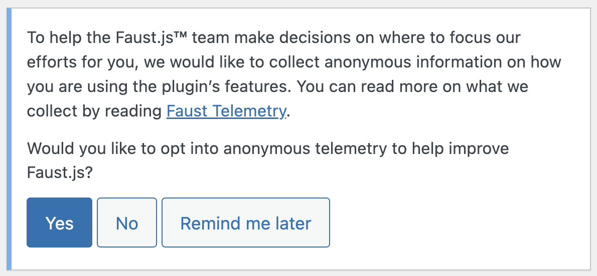

export const metadata = {
	title: "Telemetry",
};

Faust collects completely anonymous telemetry data about general usage. Participation in this anonymous program is optional. For more information on how we handle this data, please read our [Privacy Policy](/privacy-policy).

## What data we collect

### WordPress Environment

- WordPress version
- PHP version
- Faust plugin version & settings (_`frontend_uri` is not collected_)
- WordPress Multisite
- If the site is hosted on WP Engine
- Active plugins

### Node Environment

- `@faustwp/core` version
- `@faustwp/cli` version
- `@faustwp/blocks` version
- `@faustwp/block-editor-utils` version
- `@faustwp/experimental-app-router` version
- `@apollo/client` version
- Node version
- Next.js version
- If the Node environment is in **dev mode** (i.e., whether `npm run dev` was run)
- The command that was run (e.g., `npm run dev`, `npm run build`)
- The Operating System Platform name

> **_NOTE:_** We do not collect any personally identifiable information or sensitive information like environment variables, file paths, or any application URLs.

## Program Participation

If you'd like to join the program, you can enable telemetry by selecting yes on the prompt:

You can also go to the Faust Settings page and toggle your participation at anytime:

