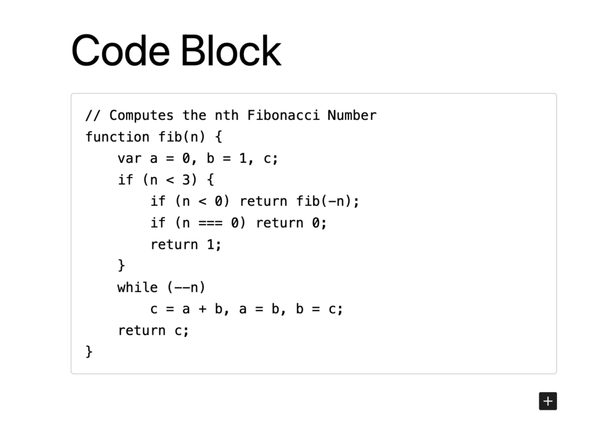
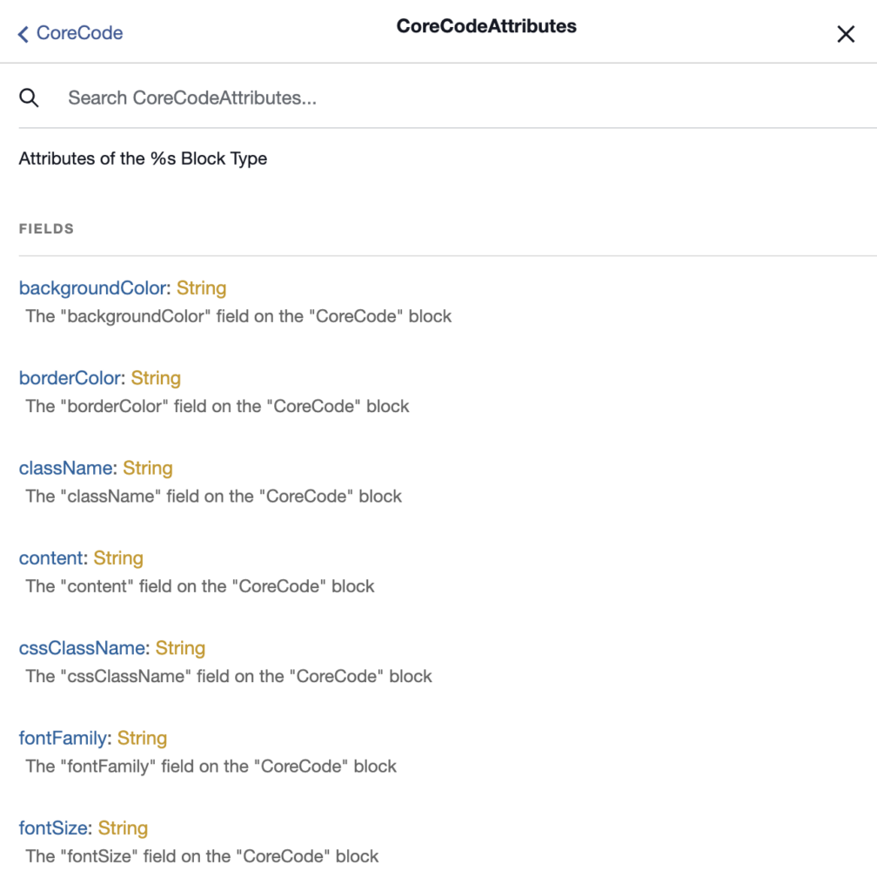
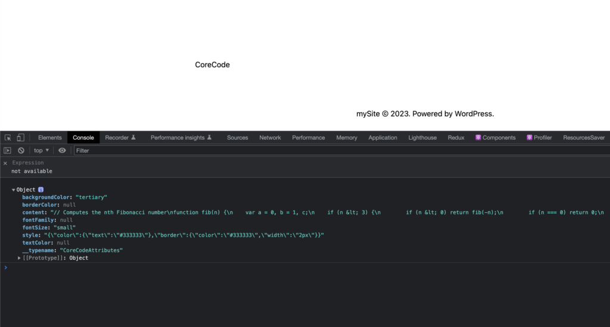
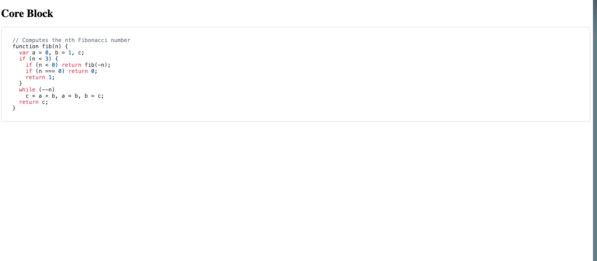

export const metadata = {
	title: "Custom blocks",
};

If you're [rendering WP Core Blocks](/docs/how-to/rendering-blocks/), but are ready to start adding support for additional blocks or override the provided default blocks, this is the place for you. We've got all that's required to override WordPress Core Blocks (the blocks that are available in the [WordPress block editor](https://wordpress.org/documentation/article/wordpress-block-editor/)). This can be useful when you want to render a block as a component in your frontend app, but take things a step further and customize its markup or functionality in some way.

## 0. Prerequisites

Ensure that you have completed the steps in our [Rendering blocks](/docs/how-to/rendering-blocks/) guide and have WordPress blocks rendering in your app successfully before proceeding with the steps below.

## 1. Choose a block to override

For this guide, we are going to override the native WordPress `Code` block that renders a formatted block of code.



### 2. Review block features and settings

Try using the block yourself in the WordPress block editor and get familiar with the features it has. Review the settings it has in the Settings Panel and change a few of them to see what they do.

### 3. Inspect the block data via the GraphiQL IDE

In the WordPress admin sidebar, go to `GraphQL` > `GraphiQL IDE` to open the GraphiQL IDE. If you're not familiar, this is a tool we can use for composing and testing GraphQL queries. This can help you understand what data your frontend app will receive when it executes a particular query.

Paste the following query into the GraphiQL IDE and hit the `▶️` button to execute the query. Replace `/posts/testing` with the path to the blog post that contains the block you want to override.

```graphql
{
	post(id: "/posts/testing", idType: URI) {
		editorBlocks {
			renderedHtml
			... on CoreCode {
				attributes {
					borderColor
					backgroundColor
					content
					style
					textColor
					fontSize
				}
			}
		}
	}
}
```

The GraphiQL IDE will then display the data that was returned in the response to that query. It should look something like the example response below.

```json
{
	"data": {
		"post": {
			"editorBlocks": [
				{
					"renderedHtml": "\n<pre class=\"wp-block-code has-border-color has-tertiary-background-color has-text-color has-background has-small-font-size\" style=\"border-color:#333333;border-width:2px;color:#333333\"><code>// Computes the nth Fibonacci number\nfunction fib(n) {\n    var a = 0, b = 1, c;\n    if (n &lt; 3) {\n        if (n &lt; 0) return fib(-n);\n        if (n === 0) return 0;\n        return 1;\n    }\n    while (--n)\n        c = a + b, a = b, b = c;\n    return c;\n}</code></pre>\n",
					"attributes": {
						"borderColor": null,
						"backgroundColor": "tertiary",
						"content": "// Computes the nth Fibonacci number\nfunction fib(n) {\n    var a = 0, b = 1, c;\n    if (n &lt; 3) {\n        if (n &lt; 0) return fib(-n);\n        if (n === 0) return 0;\n        return 1;\n    }\n    while (--n)\n        c = a + b, a = b, b = c;\n    return c;\n}",
						"style": "{\"color\":{\"text\":\"#333333\"},\"border\":{\"color\":\"#333333\",\"width\":\"2px\"}}",
						"textColor": null,
						"fontSize": "small"
					}
				}
			]
		}
	}
}
```

You can try modifying the query and running it again to see how the response changes. To learn about the fields that are available for that block, click the `Docs` link in GraphiQL, search for `CoreCode`, and click on `CoreCodeAttributes`. You will see the following:



Notice that with some of the attributes like `backgroundColor`, the editor used the [`theme.json`](https://developer.wordpress.org/themes/global-settings-and-styles/introduction-to-theme-json/) palette slug name instead of the actual value, i.e., `tertiary`. It also stored the custom hardcoded styles in the `style` fields as a JSON string. We will handle them appropriately when we override the block.

### 4. Define the block in your frontend app

Create a `wp-blocks` folder in the root folder of your project. Create a new `CoreCode.js` file inside of it that contains the following code.

```js title="wp-blocks/CoreCode.js"
import React from "react";

export default function CoreCode(props) {
	console.log(props.attributes);
	return <div>CoreCode</div>;
}

CoreCode.displayName = "CoreCode";
```

Explanation

- For now, we're just rendering a placeholder `div`. This will be replaced with actual block code in subsequent steps.
- `console.log(props.attributes)` results in the block's attributes being logged to the console so that you'll be able to inspect them.
- The `displayName` property is defined here so that when we run the `editorBlocks` query in subsequent steps, the `__typename` field in the query will match this string. This is required so that the `WordPressBlocksViewer` component can resolve and render the block properly.

Create an `index.js` file inside the `wp-blocks` folder with this code in it:

```js title="wp-blocks/index.js"
import CoreCode from "./CoreCode";

export default {
	CoreCode: CoreCode,
};
```

This file will be used to import all of the blocks you're overriding and make them available as the default export, which will be passed into `WordPressBlocksProvider` in a subsequent step.

We also define the name of the block as `CoreCode` (the property name to the left of the ":" character) to match the `__typename` value that the blocks has in the GraphQL schema.

### 5. Create the block GraphQL fragment

Create a fragment that describes the request block fields and attributes. First, `import { gql } from @apollo/client`. Then add the `CoreCode.fragments` code block, as shown below. Include all relevant fields for your implementation.

```js {2, 08-22} title="wp-blocks/CoreCode.js "
import React from "react";
import { gql } from "@apollo/client";

export default function CoreCode(props) {
	console.log(props.attributes);
	return <div>CoreCode</div>;
}

CoreCode.fragments = {
	key: `CoreCodeBlockFragment`,
	entry: gql`
		fragment CoreCodeBlockFragment on CoreCode {
			attributes {
				borderColor
				backgroundColor
				content
				style
				textColor
				fontSize
				fontFamily
				cssClassName
			}
		}
	`,
};
```

Attaching the fragment as a property of the function component (`CoreCode.fragments = ...`) is a convention that Faust.js uses to colocate fragments with the components that use them.

### 6. Include the block fragment in your page template queries

Now, you can include the block fragment inside of the GraphQL query for your posts and pages.

The example below shows a `/wp-templates/single.js` template.

```js {9-21} title="wp-templates/single.js"
import { gql } from "@apollo/client";
import blocks from "../wp-blocks";

export default function Component(props) {
	// ...
}

Component.query = gql`
  ${blocks.CoreCode.fragments.entry}
  query GetPost {
    post(id: $databaseId, idType: DATABASE_ID, asPreview: $asPreview) {
      editorBlocks {
        name
        __typename
        renderedHtml
        id: clientId
        parentClientId
        ...${blocks.CoreCode.fragments.key}
      }
    }
  }
`;
```

- `import blocks from "../wp-blocks";` imports the blocks we're overriding.
- `${blocks.CoreCode.fragments.entry}` interpolates the `CoreCode` GraphQL fragment into the page query.
- `...${blocks.CoreCode.fragments.key}` tells GraphQL to insert the `CoreCode` GraphQL fragment inside of the `editorBlocks { ... }` block.

With this code in place, when the GraphQL query for the single page template is executed, the response will now include data for the `CoreCode` block. You can follow this pattern in your other page templates to query for block data within them, as well.

If you navigate to the page that contains this block, you should be able to inspect the properties in the console and see your block attributes that were logged by `console.log(props.attributes)` in `CoreCode.js`.



### 7. Implement the block using the provided block attributes and the Editor view

Now you are ready to design the block based on the original block's look and feel.

Since the block you want to implement already consists of React elements that the WordPress block editor uses, you can review the plugin implementation of this block and try to port the parts that render the block in the frontend. This implementation can be found in the official Gutenberg `@wordpress/block-library` package. Take a look at [this folder](https://github.com/WordPress/gutenberg/tree/trunk/packages/block-library) to view the file structure and contents. You can find the attributes defined in the block's `block.json` file, which for the Code block is [here](https://github.com/WordPress/gutenberg/blob/trunk/packages/block-library/src/code/block.json).

First, we assign the same `className` `wp-block-code` for the block so that we can apply the same styles that the block editor uses.

Then we use a helper function `getStyles` that creates the final inline styles for that block based on the block attributes.

Finally, we pass `props.attributes?.content` as a string to the `code` element.

#### Import the block library styles

It will contain the front-end block styles for this `CoreCode` block. If you are working with a different block or a custom block, you will create an `scss` file in `styles/blocks/` for that specific block. However, in this case, you need to import the Gutenberg theme styles, which contain, among other things, the `CoreCode` styles:

```scss title="styles/blocks/_blocks.scss"
@use "sass:math";

@import "@wordpress/base-styles/mixins";
@import "@wordpress/base-styles/colors.native";
@import "@wordpress/base-styles/z-index";
@import "@wordpress/base-styles/default-custom-properties";
@import "@wordpress/base-styles/colors";
@import "@wordpress/base-styles/variables";
@import "@wordpress/base-styles/breakpoints";
@import "@wordpress/block-library/src/style";
@import "@wordpress/block-library/src/theme";
```

Note that Next.js won't allow you to import the `scss` file directly into the component since it requires all global CSS to be imported from the `pages` directory only. You need to either import the styles from a global module or translate the styles to use Component-Level CSS.

#### Finish the `CoreCode.js` component.

Import `getStyles` and `useBlocksTheme` from `@faustwp/blocks`. These helper functions will consolidate all the block theme attributes and create final inline stylesheet rules for that block.

Create and set `styles` to `getStyles(props.attributes)` to apply the proper formatting for the attributes. Add in the HTML markup for your block and use the `className` and `styles` variables for proper styling.

In this case, for the `CoreCode` block, we added the `pre` and `code` markup from WordPress Core and output the contents of the block using `${props.attributes?.content}`. If you chose to complete the `CoreCode` block with us, your file should match what we have here:

```js title="wp-blocks/CoreCode.js"
import React from "react";

// Import graphql and our getStyles helpers from Faust
import { gql } from "@apollo/client";
import { getStyles, useBlocksTheme } from "@faustwp/blocks";

export default function CoreCode(props) {
	// Use getStyles utility to process the props.attributes properly
	const theme = useBlocksTheme();
	const style = getStyles(theme, props);
	const { attributes } = props;

	return (
		// This markup is from the WordPress CoreCode block.
		// Add the className and styles to the markup.
		// Add props.attributes?.content to the markup.
		<pre className={attributes?.cssClassName} style={styles}>
			<code>{`${attributes?.content}`}</code>
		</pre>
	);
}

// Add fragment
CoreCode.fragments = {
	key: `CoreCodeBlockFragment`,
	entry: gql`
		fragment CoreCodeBlockFragment on CoreCode {
			attributes {
				borderColor
				backgroundColor
				content
				style
				textColor
				fontSize
				fontFamily
				cssClassName
			}
		}
	`,
};

CoreCode.displayName = "CoreCode";
```

Now that you have the styles configured correctly, you can navigate to the page that contains this block in your frontend app to confirm that the block matches the styles in the WordPress editor. Make sure to tweak the block in the WordPress block editor and verify that the changes are being reflected when you reload that page in your frontend app.



## Further considerations

> What if the block is missing some attributes?

If the block does not have any attributes or has only a few of them declared in the `block.json` for that block (you can view the `block.json` file for the block at https://github.com/WordPress/gutenberg/blob/trunk/packages/block-library/), you can still try to extend the block API by declaring additional attributes for that block.

Follow the [filters reference guide](reference/plugin-filters) to create a block that uses the `additional_block_attributes` property. The attributes will then be available to query from that block.

```php
class CoreCode extends WPGraphQL\ContentBlocks\Blocks\Block
{
    protected ?array $additional_block_attributes = array(
      // Write your attributes here
    );
}
```

Note that if you include those extensions in a custom plugin, your Headless Website application is dependent on the inclusion of this plugin. You need to make sure you bundle them together; otherwise, the queries you perform in the application will fail.

> Can I style the block differently?

Yes, you can style the block in many ways, choosing to ignore some of the attributes altogether. You can also use an external React Library to style the block, such as Material UI or ChakraUI.

Bear in mind that this will almost always result in a degraded user editing experience, as the styles in the WordPress block editor view won't match the styles of the rendered headless page.

> What if the block contains custom JavaScript assets?

Some Core blocks include JavaScript assets that are injected into the WordPress page so they can run in the front view. Many [dynamic blocks](https://developer.wordpress.org/block-editor/how-to-guides/block-tutorial/creating-dynamic-blocks/) use this functionality to include user interactivity. Since React is not bundled as a dependency in the browser, the client-side code that WordPress ships to the frontend in traditional WordPress sites typically consists of plain JavaScript or jQuery.

To review and handle bundled JavaScript assets, consider these options:

- **Include them in your code**: This is not recommended, as React does not play well with plain JavaScript and jQuery, which may lead to compatibility issues.
- **Rewrite them as React components**: You can attempt to rewrite the code in React. If the bundled code can be understood and rewritten with low effort, then this could be a viable approach.
- **Use an equivalent React Component from a library**: A simpler alternative is to find a compatible React package and use it instead of replicating the block's interactivity. This can often free the developer from implementing the functionality from scratch.

Inevitably, this is a common challenge when using Blocks in a Headless Website setup, so it's up to you to weigh the pros and cons of each approach.
