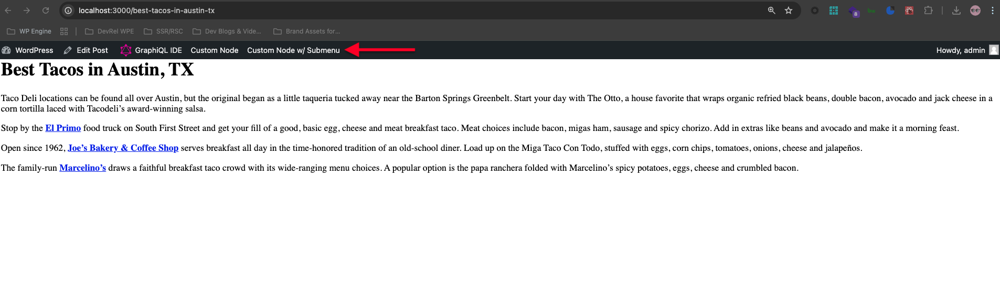

export const metadata = {
	title: "Customize The Toolbar",
	description: "",
};

This guide covers how to customize your site’s Toolbar utilizing the `toolbarNodes` filter.

## Steps

### Prerequisites

Ensure that you have completed the steps in the following pages before proceeding.

- [Basic setup](/docs/how-to/basic-setup)

- [Set up authentication](/docs/how-to/authentication/)

Implementing authentication is necessary so that Faust.js "knows" whether the current user has the permissions necessary to view and access the toolbar.

> [!NOTE]
> The Toolbar is currently an experimental feature that was introduced in `@faustwp/core@0.2.5`.

### Step 1. Add Toolbar to your project

The Faust Toolbar shares mostly the the same HTML as the WordPress core Toolbar. This enables the use of the same styles that exist in WordPress core, and have been provided for you to import within `@faustwp/core`.

```js title="pages/_app.js"
import "@faustwp/core/dist/css/toolbar.css";
```

Add `experimentalToolbar: true` to your project’s `faust.config.js`.

```js title="faust.config.js"
import { setConfig } from "@faustwp/core";
import templates from "./wp-templates";
import possibleTypes from "./possibleTypes.json";

export default setConfig({
	experimentalToolbar: true, // Enable experimental toolbar
	templates,
	possibleTypes,
});
```

### Step 2. Login to your WP Admin

The Toolbar was designed to only load for the authenticated user.

> [!IMPORTANT]
> A WordPress user will be automatically authenticated with your site when previewing a post. This approach can be used as a quick way to view the Toolbar for development purposes.

### Step 3. Create The Plugin

Create a new file in your Faust project: `plugins/CustomPlugin.tsx`.

Add the following code to `plugins/CustomPlugin.tsx`:

```ts title="plugins/CustomPlugin.tsx"

import React from 'react';
import {
  FaustHooks,
  FaustPlugin,
  FaustToolbarNodes,
  FaustToolbarContext,
  ToolbarItem,
  ToolbarSubmenu,
  ToolbarSubmenuWrapper,
} from '@faustwp/core';

/**
 * Example Custom Toolbar Plugin.
 */
export class CustomToolbar implements FaustPlugin {
  apply(hooks: FaustHooks) {
    /**
     * This example demonstrates how to filter on the core Toolbar nodes
     * in order to add your own custom nodes!
     */
    hooks.addFilter(
      'toolbarNodes',
      'faust',
      (toolbarNodes: FaustToolbarNodes, context: FaustToolbarContext) => {
        const customToolbarNodes: FaustToolbarNodes = [
          {
            id: 'custom-node',
            location: 'primary',
            component: <CustomNode />,
          },
          {
            id: 'custom-node-with-submenu',
            location: 'primary',
            component: <CustomNodeWithSubmenu />,
          },
        ];

        return [...toolbarNodes, ...customToolbarNodes];
      },
    );
  }
}

/**
 * A simple link.
 */
export function CustomNode() {
  return (
    <ToolbarItem href="https://wpengine.com" rel="nofollow">
      Custom Node
    </ToolbarItem>
  );
}

/**
 * A simple link with a submenu that displays on hover.
 */
export function CustomNodeWithSubmenu() {
  return (
    <>
      <ToolbarItem href="https://wpengine.com" rel="nofollow">
        Custom Node w/ Submenu
      </ToolbarItem>
      <ToolbarSubmenuWrapper>
        <ToolbarSubmenu>
          <li>
            <ToolbarItem href="https://wpengine.com" rel="nofollow">
              Link
            </ToolbarItem>
          </li>
          <li>
            <ToolbarItem href="https://wpengine.com" rel="nofollow">
              Link
            </ToolbarItem>
          </li>
          <li>
            <ToolbarItem href="https://wpengine.com" rel="nofollow">
              Link
            </ToolbarItem>
          </li>
        </ToolbarSubmenu>
      </ToolbarSubmenuWrapper>
    </>
  );
}
```

### Step 4. Register The Plugin

Import and register your new plugin in `faust.config.js`:

```js title="faust.config.js"
import { setConfig } from "@faustwp/core";
import templates from "./wp-templates";
import possibleTypes from "./possibleTypes.json";
import { CustomToolbar } from "./plugins/CustomPlugin.tsx";

export default setConfig({
	templates,
	experimentalToolbar: true,
	plugins: [new CustomToolbar()], // Register plugin
	possibleTypes,
});
```

You should now be able to see your new Custom Nodes and toolbar at the top of the page if you visit a route as an authenticated user like so:


