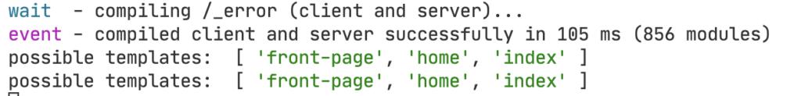

export const metadata = {
	title: "Migrate from Legacy Faust",
	description:
		"Upgrading your headless WordPress setup from GQty-based Faust to the current version. Learn how to reuse presentational components, write GraphQL queries, and adopt the WP Template system for a smooth transition",
};

Migration from the previous versions of Faust that use GQty is a manual process. However, there are some conventional techniques and best practices for React Development that will definitely help you with this process.

To migrate from the legacy version to the current version, follow the guide that most closely represents your model. Each guide recommends an integration path along with example code.

## Reusing Presentational Components

The Components folder typically contains components that embody a presentational meaning.

By presentational, we mean they do not depend on GQty or any hooks or side-effects. They just take props and render the data. Here is an example of a presentational component taken from this blueprint:

```js title="PostInfo.js"
export default function PostInfo({ className, author, date }) {
	if (!date && !author) {
		return null;
	}

	return (
		<div className={className}>
			{date && (
				<time dateTime={date}>
					<FormatDate date={date} />
				</time>
			)}
			{date && author && <>&nbsp;</>}
			{author && <span>By {author}</span>}
		</div>
	);
}
```

There is no reference to GQty or Apollo and this component can be safely re-used across different applications.

On the other hand the following component is more difficult to migrate as it depends on the GQty client:

**Before**

```js title="NavMenu.js"
export default function NavigationMenu({ className, menuLocation, children }) {
  const { useQuery } = client;
  const { nodes: menuItems } = useQuery().menuItems({
    where: {
      location: menuLocation,
    },
  });
```

You will have to either replace the `useQuery()` from GQty with the `useQuery()` of Apollo or perform the query on a higher level and pass on the menu items as props:

**After**

```js title="NavMenu.js"
export default function NavigationMenu({ menuItems, className, children }) {
  if (!menuItems) {
    return null;
  }

  return (
    <nav
    ...
  )
}
```

If you developed your components using this approach, you will be able to just transfer them without modifications to the new framework.

## Writing GraphQL Queries

The biggest hurdle when migrating from GQty to Apollo is the need to write queries manually. You need to identify the data that your pages and components need and try to request the appropriate fields.

For instance take a look at the `PostInfo` component we looked at before. It is supposed to display the `Post` Information using the `author` and `date` fields.

With GQty you didn’t have to write any queries, but you relied on query introspection based on usage. So you would have to do something like this:

**Before**

```js title="PostInfo.js"
<PostInfo
	className={styles.info}
	author={post?.author?.node?.name} // will request author name
	date={post?.date} // will request post date
/>
```

Now you need to explicitly describe what fields you want to fetch. You can request those fields once in the post or page fragment:

**After**

```gql title="GraphQL"
fragment PostsItemFragment on Post {
	id
	date
	uri
	title
	author {
		node {
			name
		}
	}
}
```

This fragment is reusable and can be applied to any page query when requesting the Post data fields:

```gql title="GraphQL"
query GetPostsPage($first: Int!, $after: String) {
	posts(first: $first, after: $after) {
		edges {
			node {
				...PostsItemFragment
			}
		}
	}
}
```

By following this approach, writing queries for your pages becomes more explicit. You will be able to find and change them easily when needed

## Using the WP Template System

If you chose to use the new Faust WP Template Hierarchy, you will need to create individual components for each Template. Those components will be rendered according to the hierarchy rules, when you visit a page on the Headless website. More specifically, you define:

- `front-page.js`: For rendering your site’s front page.
- `single.js`: For rendering a single post.
- `page.js`: For rendering a static page (page post-type).
- `category.js`: Representing category archive index pages.

The full list of templates are available at [WordPress Docs](https://developer.wordpress.org/themes/basics/template-hierarchy/#the-template-hierarchy-in-detail). Bear in mind that not all types of templates are supported within Faust. You can check the dev console when you visit a page that gives you a hint of the available templates that this route will potentially match:



You can see an example of the hierarchy in the [blueprint project](https://github.com/wpengine/atlas-blueprint-portfolio/tree/main/wp-templates) where we provided implementations for the main templates.

## Migration From GQty to Apollo

Given the above information, we can now list changes needed to migrate from GQty to Apollo.

### 1. Capture and Migrate Presentational Components

Create a list of components that can be reused in the new version of Faust and move them into the new projects folder.

### 2. Import Faust Dependencies

Start by installing the Faust.js core packages and dependencies in your terminal:

```bash
npm i @faustwp/cli @faustwp/core graphql @apollo/client
```

Change the `package.json` scripts to use the new Faust cli:

```json title="package.json"
scripts": {
    "dev": "faust dev",
    "build": "faust build",
    "generate": "faust generatePossibleTypes",
    "start": "faust start",
    "lint": "faust lint"

}
```

### 3. Use New Faust Configuration

Replace the `withFaust` configuration function with the new one for both `next.config` and `faust.config` files.

For the `next.config.js`:

```js title="next.config.js"
const { withFaust } = require("@faustjs/next");
const { withFaust, getWpHostname } = require("@faustwp/core");
```

And for the `faust.config.js`:

```js title="faust.config.js"
import { setConfig } from "@faustwp/core";
import templates from "./wp-templates";
import possibleTypes from "./possibleTypes.json";

/**
 * @type {import('@faustwp/core').FaustConfig}
 **/
export default setConfig({
	templates,
	plugins: [],
	possibleTypes,
});
```

> [!NOTE] > `experimentalPlugins` is being deprecated and replaced with `plugins` in the `faust.config.js` file.
> Please update your configuration accordingly.

### 4. Use new Faust Imports and Providers

Replace old Faust.js references with the new ones for both the API route and the `_app.js` file.

For the API route:

```js title="pages/api/faust/[[...route]].js"
import { apiRouter } from "@faustjs/core/api";
import { apiRouter } from "@faustwp/core";
```

For the `_app.js`:

```js title="pages/_app.js"
import "../faust.config";
import React from "react";
import { useRouter } from "next/router";
import { FaustProvider } from "@faustwp/core";
import "../styles/main.scss";

export default function MyApp({ Component, pageProps }) {
	const router = useRouter();

	return (
		<>
			<FaustProvider pageProps={pageProps}>
				<Component {...pageProps} key={router.asPath} />
			</FaustProvider>
		</>
	);
}
```

### 5. Create the new wp-templates folder and include an index.js page

You should be using the Apollo Client from now on to prepare queries and mutations.

If you are not using the `wp-templates` system, you can take a look a the [`search.js`](https://github.com/wpengine/atlas-blueprint-portfolio/blob/main/pages/search.js) component which uses the Next.js `getNextStaticProps` page helpers.

### 6. Add the WordPressTemplate and getWordPressProps when using Template Hierarchy

For `pages/index.js` and `pages/[...wordpressNode].js`:

```js title="pages/index.js and pages/[...wordpressNode].js"
import { getWordPressProps, WordPressTemplate } from "@faustwp/core";

export default function Page(props) {
	return <WordPressTemplate {...props} />;
}

export function getStaticProps(ctx) {
	return getWordPressProps({ ctx });
}
```

For `pages/preview.js`:

```js title="pages/preview.js"
import { getWordPressProps, WordPressTemplate } from "@faustwp/core";

export default function Page(props) {
	return <WordPressTemplate {...props} />;
}
```

At this point you should be able to run the dev server and inspect if something is missing or not working properly. Fix them, rinse and repeat.

### 7. Clean up any references of GQty

Once everything is working with the new Faust, you should be able to remove any unused references to the old framework.

Those include:

- The `gqty.config.js`.
- The client folder.
- The `@faustjs/core`, `@faustjs/next` and `gqty` dependencies.
- Any skeleton renders as a result of GQty side effects.

## Working with Apollo

While migrating your app from GQty to Apollo, you will find that the Apollo Ecosystem has plenty of resources and tools to help you work with GraphQL. We list some of the available tools here that will definitely help you:

- **Apollo Client DevTools**: DevTools is a debugger toolbar for Chrome that allows you to inspect and perform queries against the GraphQL Endpoint within the browser. This tool is invaluable when trying to migrate existing GQty hooks into Apollo. [Link to Download](https://chromewebstore.google.com/detail/apollo-client-devtools/jdkknkkbebbapilgoeccciglkfbmbnfm)

- **Apollo Fragments Guide**: Using the new Faust, you will need to write queries manually. Using GraphQL fragments is a recommended way to share pieces of logic between multiple queries and mutations. Read [this guide](https://www.apollographql.com/docs/react/data/fragments) for best practices and great techniques to maximize using fragments.
