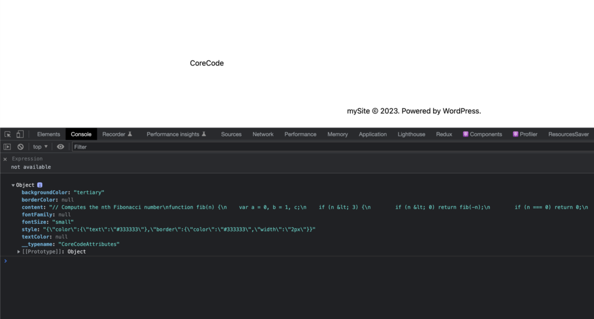
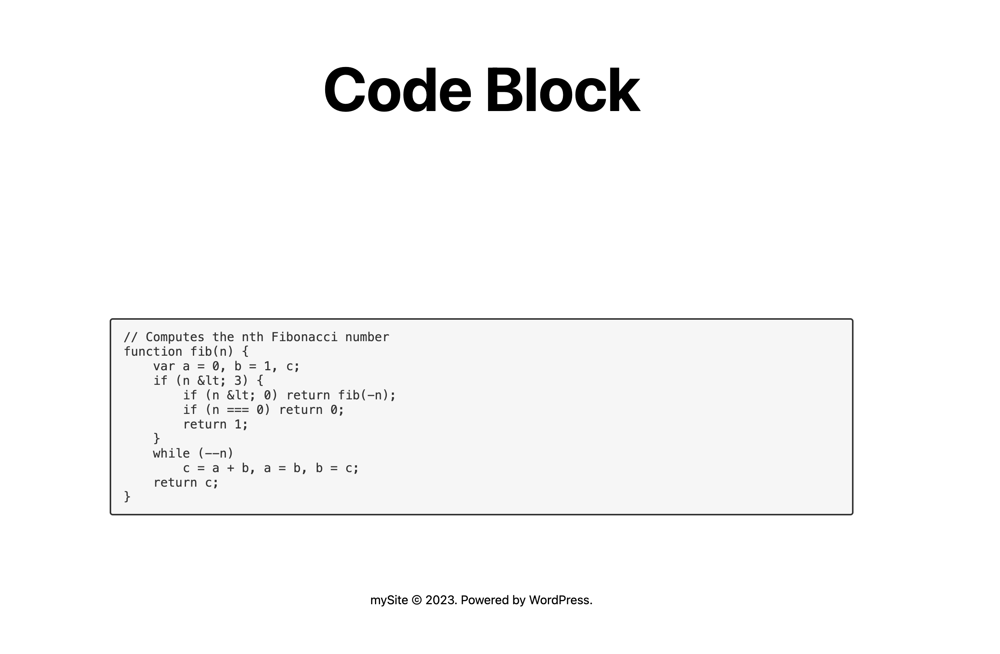

export const metadata = {
	title: "Override Default Blocks",
	description:
		"Learn to override the provided WordPress Core Blocks in your Faust.js project for a more custom experience.",
};

If you're [rendering WP Core Blocks](/docs/how-to/rendering-blocks/), but are ready to start overriding the provided default blocks, this is the place for you. We've got all that's required to override WordPress Core Blocks (the blocks that are available in the [WordPress block editor](https://wordpress.org/documentation/article/wordpress-block-editor/)). This can be useful when you want to render a block as a component in your frontend app, but take things a step further and customize its markup or functionality in some way.

> [!INFO]
> If you're looking to add support for custom blocks, you can follow the steps in our [Custom Blocks](/docs/how-to/custom-blocks/) guide.

## 0. Prerequisites

Ensure that you have completed the steps in our [Rendering blocks](/docs/how-to/rendering-blocks/) guide and have WordPress blocks rendering in your app successfully before proceeding with the steps below.

## 1. Choose a block to override

For this guide, we are going to override the native WordPress `Code` block that renders a formatted block of code.


## 2. Review block features and settings

Try using the block yourself in the WordPress block editor and get familiar with the features it has. Review the settings it has in the Settings Panel and change a few of them to see what they do.

## 3. Inspect the block data via the GraphiQL IDE

In the WordPress admin sidebar, go to `GraphQL` > `GraphiQL IDE` to open the GraphiQL IDE. If you're not familiar, this is a tool we can use for composing and testing GraphQL queries. This can help you understand what data your frontend app will receive when it executes a particular query.

Paste the following query into the GraphiQL IDE and hit the `▶️` button to execute the query. Replace `/posts/testing` with the path to the blog post that contains the block you want to override.

```graphql
{
	post(id: "/posts/testing", idType: URI) {
		editorBlocks {
			renderedHtml
			... on CoreCode {
				attributes {
					borderColor
					backgroundColor
					content
					style
					textColor
					fontSize
				}
			}
		}
	}
}
```

The GraphiQL IDE will then display the data that was returned in the response to that query. It should look something like the example response below.

```json
{
	"data": {
		"post": {
			"editorBlocks": [
				{
					"renderedHtml": "\n<pre class=\"wp-block-code has-border-color has-tertiary-background-color has-text-color has-background has-small-font-size\" style=\"border-color:#333333;border-width:2px;color:#333333\"><code>// Computes the nth Fibonacci number\nfunction fib(n) {\n    var a = 0, b = 1, c;\n    if (n &lt; 3) {\n        if (n &lt; 0) return fib(-n);\n        if (n === 0) return 0;\n        return 1;\n    }\n    while (--n)\n        c = a + b, a = b, b = c;\n    return c;\n}</code></pre>\n",
					"attributes": {
						"borderColor": null,
						"backgroundColor": "tertiary",
						"content": "// Computes the nth Fibonacci number\nfunction fib(n) {\n    var a = 0, b = 1, c;\n    if (n &lt; 3) {\n        if (n &lt; 0) return fib(-n);\n        if (n === 0) return 0;\n        return 1;\n    }\n    while (--n)\n        c = a + b, a = b, b = c;\n    return c;\n}",
						"style": "{\"color\":{\"text\":\"#333333\"},\"border\":{\"color\":\"#333333\",\"width\":\"2px\"}}",
						"textColor": null,
						"fontSize": "small"
					}
				}
			]
		}
	}
}
```

You can try modifying the query and running it again to see how the response changes. To learn about the fields that are available for that block, click the `Docs` link in GraphiQL, search for `CoreCode`, and click on `CoreCodeAttributes`. You will see the following:


Notice that with some of the attributes like `backgroundColor`, the editor used the [`theme.json`](https://developer.wordpress.org/themes/global-settings-and-styles/introduction-to-theme-json/) palette slug name instead of the actual value, i.e., `tertiary`. It also stored the custom hardcoded styles in the `style` fields as a JSON string. We will handle them appropriately when we override the block.

## 4. Define the block in your frontend app

### A. Create a new block component

Create a new `CoreCode.js` file inside of your `wp-blocks` folder that contains the following code.

```js title="wp-blocks/CoreCode.js"
export default function CoreCode(props) {
	console.log(props.attributes);
	return <div>CoreCode</div>;
}

CoreCode.displayName = "CoreCode";
```

For now, we're just rendering a placeholder `div` and logging the data to the console. This will be replaced with actual block code in subsequent steps.

> [!INFO]- Context
> The `displayName` property is defined here so that when we run the `editorBlocks` query in subsequent steps, the `__typename` field in the query will match this string. This is required so that the `WordPressBlocksViewer` component can resolve and render the block properly.

### B. Register the new block component

Open the `index.js` file inside the `wp-blocks` folder and add your new block like this:

```js title="wp-blocks/index.js"
import { CoreBlocks } from "@faustwp/blocks";
import CoreCode from "./CoreCode";

export default {
	...CoreBlocks,
	CoreCode: CoreCode, // [++code]
};
```

> [!NOTE]- Context
> This file will be used to import all of the blocks you're overriding and make them available as the default export, which will be passed into `WordPressBlocksProvider` in a subsequent step.

> We also define the name of the block as `CoreCode` (the property name to the left of the ":" character) to match the `__typename` value that the blocks has in the GraphQL schema.

### C. Create the block GraphQL fragment

Create a fragment that describes the request block fields and attributes. First, `import { gql } from @apollo/client`. Then add the `CoreCode.fragments` code block, as shown below. Include all relevant fields for your implementation.

```js {2, 08-22} title="wp-blocks/CoreCode.js "
import { gql } from "@apollo/client";

export default function CoreCode({ attributes }) {
	console.log(attributes);
	return <div>CoreCode</div>;
}

CoreCode.fragments = {
	key: `CoreCodeBlockFragment`,
	entry: gql`
		fragment CoreCodeBlockFragment on CoreCode {
			attributes {
				borderColor
				backgroundColor
				content
				style
				textColor
				fontSize
				fontFamily
				cssClassName
			}
		}
	`,
};
```

> [!INFO]- Context
> Attaching the fragment as a property of the function component (`CoreCode.fragments = ...`) is a convention that Faust.js uses to [colocate fragments](https://www.apollographql.com/docs/react/data/fragments#colocating-fragments) with the components that use them.

### D. Include the block fragment in your page template queries

Now, you can include the block fragment inside of the GraphQL query for your posts and pages.

The example below shows a `/wp-templates/single.js` template.

```js {2, 9, 18} title="wp-templates/single.js"
import { gql } from "@apollo/client";
import blocks from "../wp-blocks";

export default function Component(props) {
	// ...
}

Component.query = gql`
  ${blocks.CoreCode.fragments.entry}
  query GetPost {
    post(id: $databaseId, idType: DATABASE_ID, asPreview: $asPreview) {
      editorBlocks {
        name
        __typename
        renderedHtml
        id: clientId
        parentClientId
        ...${blocks.CoreCode.fragments.key}
      }
    }
  }
`;
```

- `import blocks from "../wp-blocks";{:js}` imports the blocks we're overriding.
- `${blocks.CoreCode.fragments.entry}{:js}` interpolates the `CoreCode` GraphQL fragment into the page query.
- `...${blocks.CoreCode.fragments.key}{:js}` tells GraphQL to insert the `CoreCode` GraphQL fragment inside of the `editorBlocks { ... }{:gql}` block.

With this code in place, when the GraphQL query for the single page template is executed, the response will now include data for the `CoreCode` block. You can follow this pattern in your other page templates to query for block data within them, as well.

### E. Verify the block data in the frontend app

If you navigate to the page that contains this block, you should be able to inspect the properties in the console and see your block attributes that were logged by `console.log(props.attributes)` in `CoreCode.js`.



## 5. Implement the block

You now have the block data available in your frontend app and are ready to implement the block's structure, styling, and functionality.

> [!IMPORTANT] Options
> You've done the hard work of getting the data into your app and integrating with the `@faustwp/blocks` package. How you implement this block is completely up to you. You can use any React component library, CSS-in-JS solution, or custom styles you like.
>
> Keep in mind, If your implementation deviates from the WP implementation your content editors might find this confusing. For this guide, we'll show you a basic implementation of the `CoreCode` block.

Replace the `CoreCode` component with the following code. This code will render the block in the frontend app with a similar structure to the WordPress block editor.

```js title="wp-blocks/CoreCode.js"
import { gql } from "@apollo/client";

export default function CoreCode({ attributes }) {
	return (
		<pre className={attributes?.cssClassName}>
			<code>{`${attributes?.content}`}</code>
		</pre>
	);
}

CoreCode.fragments = {
	key: `CoreCodeBlockFragment`,
	entry: gql`
		fragment CoreCodeBlockFragment on CoreCode {
			attributes {
				content
			}
		}
	`,
};

CoreCode.displayName = "CoreCode";
```

## 6. Implement the block styles

Let's add some code hilighting to this compoent to really make it pop.

> [!IMPORTANT] Options
> We're going to leave the specific styling up you. You can choose to statically style in here or you could leverage the other available `attributes` to style the block dynamically from the WordPress block editor. Faust does [support styling](/docs/reference/get-styles/) blocks using your WordPress Block theme styles.

### A. Install the `highlight.js` package by running the following command:

```bash
npm add highlight.js
```

### B. Import the `highlight.js` package in the `_app_.js` file:

```js title="_app.js"
// THIS IS VERY IMPORTANT.
// In Next.js, put this in your _app.js file
import "highlight.js/styles/github.css";
```

### C. Update the Component

Update the `CoreCode.js` with the code bellow to add code highlighting:

```js title="wp-blocks/CoreCode.js"
import { gql } from "@apollo/client";
import { useEffect } from "react";
import hljs from "highlight.js";

export default function CoreCode({ attributes }) {
	useEffect(() => {
		hljs.highlightAll();
	});

	return (
		<pre className={attributes?.cssClassName}>
			<code>{`${attributes?.content}`}</code>
		</pre>
	);
}

CoreCode.fragments = {
	key: `CoreCodeBlockFragment`,
	entry: gql`
		fragment CoreCodeBlockFragment on CoreCode {
			attributes {
				content
			}
		}
	`,
};

CoreCode.displayName = "CoreCode";
```

## 7. Wrapping up...

Now that you have `highlight.js` added.


