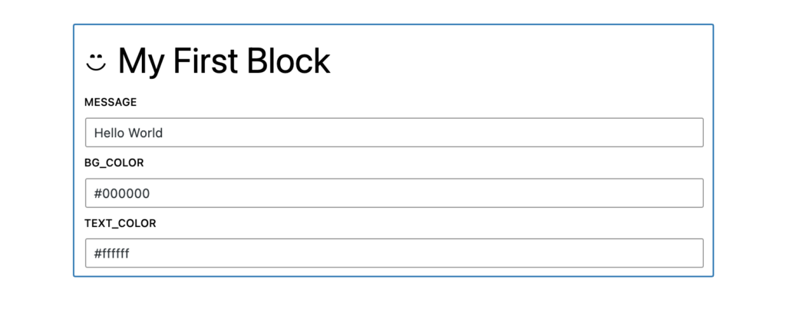
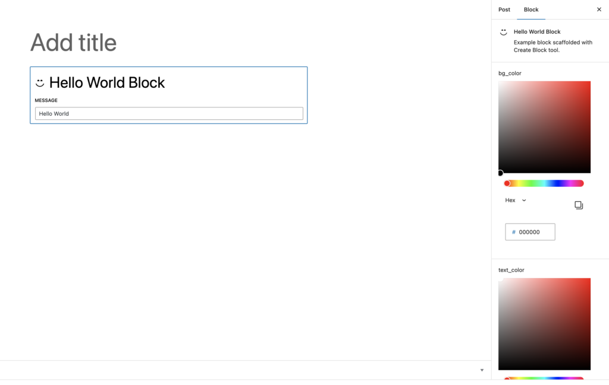

export const metadata = {
	title: "React Components to Blocks",
	description:
		"Create blocks in your Next.js app that also work in the WordPress Block Editor.",
};

The `@faustwp/block-editor-utils` package provides helper functions for converting React components into blocks. This means you can use the same components in both places—your Next.js app and the WordPress Block Editor.

In this how-to guide, we will walk through the steps required to create a new block named `my-first-block` using this workflow.

## Prerequisites

Make sure you have followed the [Basic Setup](/docs/how-to/basic-setup/) steps to get Faust.js set up.

## 1. Install the Dev Dependencies

First, from your root folder, install the required dev dependencies:

```bash
npm install @wordpress/scripts @faustwp/block-editor-utils --save-dev
```

Now we're ready to explore the process of using this package's helpers to convert a React component to blocks.

## 2. Create and Register a Block Component

For the purposes of this guide we are using the a simple React component. Add a folder called `my-first-block` to the `wp-blocks` folder, then add the following into a jsx file called `MyFirstBlock.jsx`:

```js title="MyFirstBlock.jsx"
function MyFirstBlock({ style, className, attributes, children, ...props }) {
	const styles = {
		...style,
	};
	const cssClassName = "create-block-my-first-block";
	return (
		<div
			style={styles}
			className={cssClassName}
			dangerouslySetInnerHTML={{ __html: attributes.message }}
		/>
	);
}

export default MyFirstBlock;
```

This React component consists of a `div` element with three attributes that controls the content and the style of the box. Let's describe them briefly:

- **message**: is a text message that gets displayed.
- **bg_color**: controls the background color.
- **text_color**: controls the text color.

We would like to use this React component in WordPress using the Block Editor. Traditionally, this step would require us (the developers) to register a block within WordPress, provide a `block.json` and write code for the [Edit and Save](https://developer.wordpress.org/block-editor/reference-guides/block-api/block-edit-save/) functions for the editor. Once those steps are done, then the block would be usable in the Block Editor list.

That is a lot of know-how and development effort for simply trying to use the React component in the editor side. What if we just provided the React component and let the framework handle all the block registration and creating the editor form fields for changing the content?

This is what `@faustwp/block-editor-utils` package tries to do. It provides a `registerFaustBlock` helper function, that handles all the necessary configuration, registration and generation of Editor Form fields and [Inspector controls](https://developer.wordpress.org/block-editor/how-to-guides/block-tutorial/block-controls-toolbar-and-sidebar/) for you. A developer can provide the React component and are able to review this within the WordPress Block Editor and use it in both places.

```js title="index.js"
import "./style.scss";

// Import block.json
import metadata from "./block.json";

// Import our React component
import MyFirstBlock from "./MyFirstBlock";

import { registerFaustBlock } from "@faustwp/block-editor-utils";

// Register the React component as a Block Editor block
registerFaustBlock(MyFirstBlock, { blockJson: metadata });
```

The `registerFaustBlock` helper takes the following arguments:

- **component**: the actual React component to convert into a Block Editor block. (**Required**).
- **metadata**: a metadata object that contains several fields:
  - **blockJson**: the `block.json` object that describes the component attributes. (**Required**).
  - **edit**: provides a custom Edit function that describes the structure of your block in the context of the editor. (**Optional**).
  - **save**: provides a custom Save function that defines the way in which the different attributes should be combined into the final markup. (**Optional**).

Now let's take a look at the `block.json`. Since we declared three configurable attributes for our component, we need to declare them as attributes here.

Here is the final `block.json` with the assigned attributes object:

```json
{
	"$schema": "https://schemas.wp.org/trunk/block.json",
	"apiVersion": 2,
	"name": "create-block/my-first-block",
	"version": "0.1.0",
	"title": "My First Block",
	"category": "widgets",
	"icon": "smiley",
	"description": "Example block scaffolded with Create Block tool.",
	"supports": {
		"html": false
	},
	"attributes": {
		"message": {
			"type": "string",
			"default": "My First Block"
		},
		"bg_color": { "type": "string", "default": "#000000" },
		"text_color": { "type": "string", "default": "#ffffff" }
	},
	"textdomain": "my-first-block",
	"editorScript": "file:./index.js",
	"editorStyle": "file:./index.css",
	"style": "file:./style-index.css"
}
```

### 3. Sync the block with WordPress

Add the following `blockset` script to your `package.json` file, then run it on the command line:

```json title="package.json"
"scripts": {
  ...
  "blockset": "faust blockset"
},
```

```sh
npm run blockset
```

The cli tool will compile the blocks within the `wp-blocks` folder and upload them to your WordPress site in a special location that Faust uses to detect and register the blocks.

## 4. Try out the Component in the Block Editor

Open the WordPress Block Editor and try out the new block. This is what it will look like at first glance in Edit mode:



You can interact with the form fields, and then click outside the block contents where you will see the component rendered in Preview mode.


## 5. Configure the Form Controls

So far we've been able to render the React component in the Block Editor, change some of the attributes, and reflect the changes in the page.

However, a few of the attributes that control the color are using [text field](https://developer.wordpress.org/block-editor/reference-guides/components/text-control/) controls, which may prove problematic since they allow invalid values. What if we wanted to use a proper color picker component?

Since the `block.json` [attribute types](https://developer.wordpress.org/block-editor/reference-guides/block-api/block-attributes/#type-validation) do not allow `color` as a value, we will have to provide a different configuration to allow that option.

When registering the React component using `registerFaustBlock` , it allows extra configuration to be used in case you want to declare which kinds of controls to use on each attribute.

Add the following config object as a property to the `MyFirstBlock` function:

```js title="MyFirstBlock.jsx"
...
MyFirstBlock.config = {
    name: "MyFirstBlock",
    editorFields: {
        bg_color: {
            location: "inspector",
            control: "color",
        },
        text_color: {
            location: "inspector",
            control: "color",
        },
    },
};
```

Here we included an object with the following properties:

- **name**: the name of the block.
- **editorFields**: the list of Editor metadata configuration. This consists of two attributes that we want to specify: the type of control to use and the location within the editor. For example, by using `location: "inspector",` we are telling this control to appear in the [Block Sidebar](https://developer.wordpress.org/block-editor/how-to-guides/block-tutorial/block-controls-toolbar-and-sidebar/) section. By using `control: "color"`, we are indicating that we want to use a [ColorPicker](https://developer.wordpress.org/block-editor/reference-guides/components/color-picker/) component instead of the regular `TextControl`.

Once you update the component, you can refresh the page and create a new block. Now instead of having two text fields inside the block, we have two `ColorPicker` fields in the sidebar section:



## 6. Form Control Reference List

So far we've seen examples of two controls: The `ColorPicker` handled by the `control: "color"` and the `TextControl`, which is set as default for every `type: "string"` in the `block.json` attributes list. You can experiment with adding more, however.

The corresponding table represents the mapping logic between the `block.json` attributes and their associated fields:

| type    | field           | comment                                                                                                                                |
| ------- | --------------- | -------------------------------------------------------------------------------------------------------------------------------------- |
| string  | TextControl     | Renders a [TextControl field](https://developer.wordpress.org/block-editor/reference-guides/components/text-control/) of type `text`   |
| boolean | RadioControl    | Renders a [RadioControl field](https://developer.wordpress.org/block-editor/reference-guides/components/radio-control/)                |
| integer | TextControl     | Renders a [TextControl field](https://developer.wordpress.org/block-editor/reference-guides/components/text-control/) of type `number` |
| number  | TextControl     | Renders a [TextControl field](https://developer.wordpress.org/block-editor/reference-guides/components/text-control/) of type `number` |
| object  | TextAreaControl | Renders a [TextAreaControl field](https://developer.wordpress.org/block-editor/reference-guides/components/textarea-control/)          |

The following control types will also be available when using the `editorFields` metadata when specifying a `control` property:

| control  | field           | comment                                                                                                                                |
| -------- | --------------- | -------------------------------------------------------------------------------------------------------------------------------------- |
| color    | ColorPicker     | Renders a [ColorPicker field](https://developer.wordpress.org/block-editor/reference-guides/components/color-picker/)                  |
| text     | TextControl     | Renders a [TextControl field](https://developer.wordpress.org/block-editor/reference-guides/components/text-control/) of type `text`   |
| textarea | TextAreaControl | Renders a [TextAreaControl field](https://developer.wordpress.org/block-editor/reference-guides/components/textarea-control/)          |
| radio    | RadioControl    | Renders a [RadioControl field](https://developer.wordpress.org/block-editor/reference-guides/components/radio-control/)                |
| select   | SelectControl   | Renders a [SelectControl field](https://developer.wordpress.org/block-editor/reference-guides/components/select-control/)              |
| range    | RangeControl    | Renders a [RangeControl field](https://developer.wordpress.org/block-editor/reference-guides/components/range-control/)                |
| number   | TextControl     | Renders a [TextControl field](https://developer.wordpress.org/block-editor/reference-guides/components/text-control/) of type `number` |
| checkbox | CheckBoxControl | Renders a [CheckBoxControl field](https://developer.wordpress.org/block-editor/reference-guides/components/checkbox-control/)          |

> [!NOTE]
> The `editorFields` configuration provides necessary hints for the helper to render the specified controls. It always overrides any configuration that is declared in the `block.json` attributes section. If you are not seeing the appropriate control used, check that your `editorFields` contain the correct attribute name and the correct `control` property.

## Learn More

This concludes this how-to guide for using the `@faustwp/block-editor-utils` package to convert React components into Block Editor blocks. To learn more, see [this RFC document](https://github.com/wpengine/faustjs/issues/1522) that explains in detail the different options and configurations regarding the usage of the `@faustwp/block-editor-utils`.
