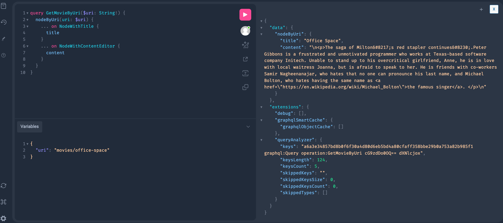
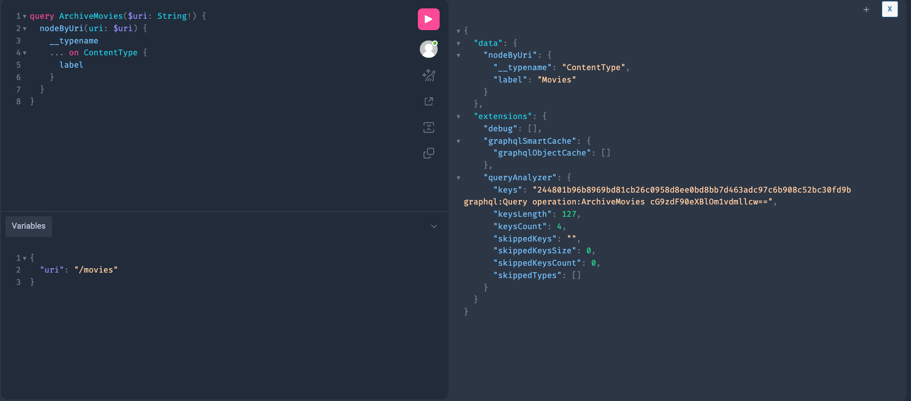

export const metadata = {
	title: "Set up Custom Post Types (CPTs) in Faust",
};

This guide covers how to set up Custom Post Types in your Faust templates.

## Steps

### 1. Basic setup

If you haven't already, follow the [Basic Setup](/docs/how-to/basic-setup/) steps to get Faust.js set up.

### 2. Download ACF and WPGraphQL for ACF

Download the [Advanced Custom Fields](https://www.advancedcustomfields.com/download/) plugin and the [WPGraphQL for ACF](https://github.com/wp-graphql/wpgraphql-acf) plugin in your WordPress admin.

### 3\. Verify Your CPT Was Setup Properly

For this example, let's create a custom post type called `movies` with that same slug." If you are new to using the ACF plugin, please reference their [docs](https://www.advancedcustomfields.com/resources/) on how to create post types and fields.

Once you create a custom post type called `movies`, create a field called `title` for the post type. Then toggle the **_Archive_** slider to the color blue. In the **_Archive Slug_** field, input the string `/movies`. You should have a page that looks like this:


Do not forget to toggle the **_"Show in GraphQL"_** slider to blue in the advanced settings section of the edit post type page or you will not have see it in WPGraphQL:


Next, navigate to the edit page of the movies post type you just created and add some content and a title.
Then, visit the page on WordPress to make sure it’s public:


### 4. Access the data in WPGraphQL

Now let’s make sure we can access the `movie` and the `archive` in WPGraphQL. You can use the following query to do so by copying and pasting it into GraphQL IDE :

```gql title="GraphQL"
query GetMovieByUri($uri: String!) {
	nodeByUri(uri: $uri) {
		... on NodeWithTitle {
			title
		}
		... on NodeWithContentEditor {
			content
		}
	}
}
```

Then add the query variables:

```json title="Variables"
{
	"uri": "movies/office-space"
}
```

Once you press the play button in the GraphQL IDE, you should successfully get the CPT data of `title` and `content` back:



Finally, let's check to see if the archive is accessible. Copy and paste this query into the GraphQL IDE:

```gql title="GraphQL"
query ArchiveMovies($uri: String!) {
	nodeByUri(uri: $uri) {
		__typename
		... on ContentType {
			label
		}
	}
}
```

And the query variables:

```json title="Variables"
{
	"uri": "/movies"
}
```

The CPT should come back in response in the IDE:



### 5. Generate Possible Types

The next thing we need to do generate possible types for Apollo. These possible types tell Apollo what is available in your schema, and how it caches data. Since we added a new CPT, the possible types have changed, so a regeneration is required.

You can do this by running the `faust generatePossibleTypes` script. In the getting started project, this is mapped to `npm run generate`. You can run that command in your terminal and it will run the script.

### 6. Create A Faust Single Movie Template

With possible types generated, we can now start creating Faust templates for our CPTs!

Before we begin, start the dev server in the Faust app with the dev command:
`npm run dev`
