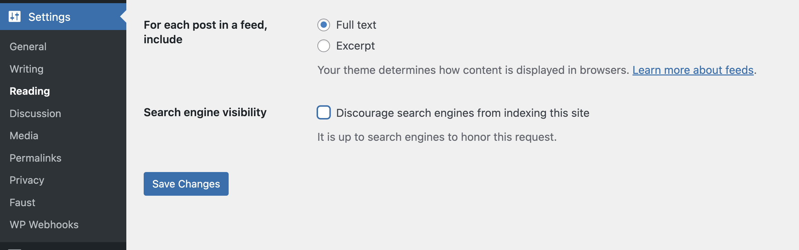

export const metadata = {
	title: "Sitemaps",
};

Sitemaps can be a complicated process when using WordPress in a headless environment. Thankfully, Faust takes care of all your sitemap needs through creation of a file within the pages directory.

## 0. Prerequisites

Ensure that you have completed the steps in the following pages before proceeding.

- [Basic setup](/docs/how-to/basic-setup)

## 1. Enable Search Engine Visibility

1. In your WordPress Admin, go to **Settings > Reading**.
2. Uncheck the _"Discourage search engines from indexing this site"_ box.
3. Visit the sitemap url (e.g. `https://[your-domain.com]/wp-sitemap.xml`) on the WordPress domain to ensure the sitemap is loading correctly.

   

## 2. Create `sitemap.xml.js`

Go to the root of your Faust.js app. Navigate to the `/pages` directory. Within the pages directory, create a file and name it `sitemap.xml.js`.

In the `sitemap.xml.js` you just created, copy and paste this code block:

```js title="/pages/sitemap.xml.js"
import { getSitemapProps } from "@faustwp/core";

export default function Sitemap() {}

export function getServerSideProps(ctx) {
	return getSitemapProps(ctx, {
		frontendUrl: process.env.FRONTEND_URL,
	});
}
```

This file does the following:

- Imports the `getSitemapProps` function from Faust.js.
- Exports a default Sitemap component.
- Uses Next.js’ `getServerSideProps` to fetch sitemap data.
- Passes `frontendUrl` to `getSitemapProps`.

Save the file and run `npm run dev` in your terminal and visit `localhost:3000/sitemap.xml`.
You now will dynamically serve WordPress content to your headless site through the sitemap.

## 3. Defining Next.js Pages for Sitemaps

Since we are using Headless WordPress, the front-end URLs need to be on the sitemap as well. Within the same `sitemap.xml.js` file, simply add a pages property array and place the relative paths of Next.js in the objects within the array like so:

```js title="pages/sitemap.xml.js"
import { getSitemapProps } from "@faustwp/core";
export default function Sitemap() {}

export function getServerSideProps(ctx) {
	return getSitemapProps(ctx, {
		frontendUrl: process.env.FRONTEND_URL,
		pages: [
			{
				path: "/about",
				changefreq: "monthly",
			},
			{
				path: "/",
			},
		],
	});
}
```

Run the dev server again and visit the sitemap URL. You now have WordPress content and Next.js content in your Faust app.

## 4. Changing the sitemap URL for other WP SEO plugins

If you prefer to use a different sitemap instead of the default one provided by WordPress, Faust allows integration with other WordPress SEO plugins like [Rank Math](https://rankmath.com/) or [Yoast SEO](https://yoast.com/wordpress/plugins/seo/).

Simply update the `sitemapIndexPath` argument to point to the plugin's sitemap URL.

Here is an example for the Rank Math plugin:

```js {6} title="pages/sitemap.xml.js"
import { getSitemapProps } from "@faustwp/core";
export default function Sitemap() {}

export function getServerSideProps(ctx) {
	return getSitemapProps(ctx, {
		sitemapIndexPath: "sitemap_index.xml",
		frontendUrl: process.env.FRONTEND_URL,
	});
}
```
