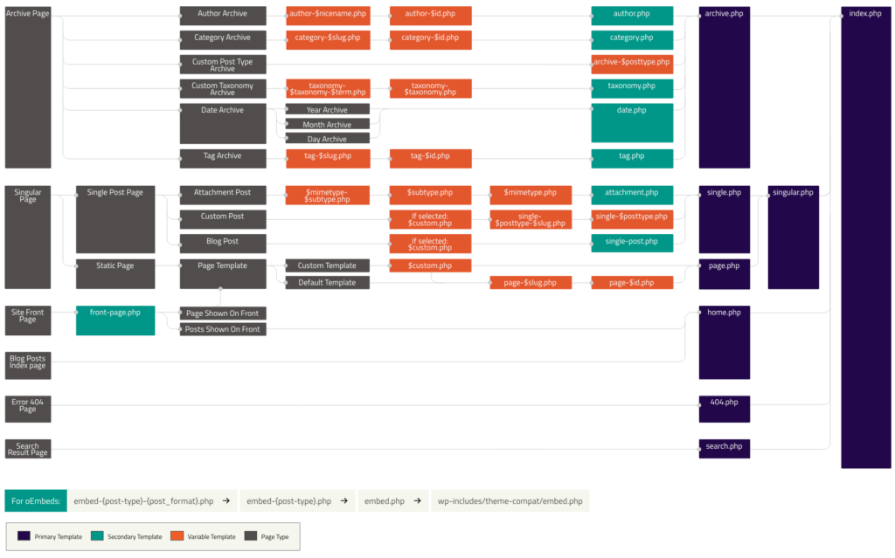

export const metadata = {
	title: "Template Hierarchy",
};

WordPress provides a powerful feature called the [template hierarchy](https://developer.wordpress.org/themes/basics/template-hierarchy/), which determines which template should be used to render a given page. This feature is illustrated by the following image.



When WordPress receives a webpage request, it starts on the left side of this flowchart and proceeds to the right. First, it checks which type of page is being requested (an archive page, a singular page, etc.). It also checks for the existence of template files along the way. The first template file that exists and is relevant to the incoming request is used to render the content.

The convention for adding pages to a Next.js app is to hardcode them by adding files to the `/pages` folder. While this works in many cases, the template hierarchy provides more flexibility since it allows WordPress to determine which template should be used for each page.

In this doc, we will walk through how to add template hierarchy support to your headless WordPress project using Faust.js.

## Steps

### 1\. Basic setup

If you haven't already, follow the [Basic Setup](/docs/how-to/basic-setup/) steps to get Faust.js set up.

### 2\. Install dependencies

Install the `@faustwp/cli` NPM package in your Next.js project.

```
npm install @faustwp/cli
```

ShellScript

### 3\. Generate types

In order for Faust.js to run the GraphQL queries it needs to determine the correct template to use, it needs to have a list of all the types available in the GraphQL schema. We'll generate this list of types now.

Add the following `generate` script to your Next.js project's `package.json` file, in the `scripts` block:

```
  "scripts": {
    "dev": "next dev",
    "build": "next build",
    "generate": "faust generatePossibleTypes",
    "start": "next start",
    "lint": "next lint"
  },
```

JSON

Run `npm run generate` on the command line. Confirm that a `possibleTypes.json` has been generated in the root of your project.

### 4\. Add a template

Create a new `wp-templates` folder in the root of your project. This is where your template files will be stored. We'll start by adding a template for rendering single blog posts.

Inside the `wp-templates` folder, create a `single.js` file that contains the following code.

```
import { gql } from "@apollo/client";

export default function SingleTemplate(props) {
  const { title, content } = props.data.post;

  return (
    <>
      <h1>{title}</h1>
      <div dangerouslySetInnerHTML={{ __html: content }} />
    </>
  );
}

SingleTemplate.query = gql`
  query GetPost($uri: ID!) {
    post(id: $uri, idType: URI) {
      title
      content
    }
  }
`;

SingleTemplate.variables = (seedQuery, ctx) => {
  return {
    uri: seedQuery?.uri,
  };
};
```

JSX

Inside of the `SingleTemplate.variables` function, we pass in the URI of the current page so that it's available for GraphQL queries to use.

Inside the `SingleTemplate.query` tagged template literal, we pass the `uri` for the current page into the GraphQL query, telling WordPress that we want to fetch the `title` and `content` for the post matching that URI.

In the `SingleTemplate` component, we receive the props, destructure the `title` and `content`, then return some JSX to render the title and content to the page.

Finally, we have to make Faust.js aware that this template exists. To do that, create an `index.js` file inside the `wp-templates` folder with this code inside:

```
import single from "./single";

const templates = {
  single,
};

export default templates;
```

JavaScript

### 5\. Set up Faust.js config

If you don't have one already, add a `faust.config.js` file to the root of your project. Put the following code inside.

```
import { setConfig } from "@faustwp/core";
import templates from "./wp-templates/index.js";
import possibleTypes from "./possibleTypes.json";

/**
 * @type {import('@faustwp/core').FaustConfig}
 **/
export default setConfig({
  templates,
  possibleTypes,
});
```

JavaScript

Here, we call the `setConfig()` function that Faust.js provides, passing in our `templates` and `possibleTypes` to it.

### 6\. Create a catch-all route

Create a `[...wordpressNode].js` file inside your `pages` folder. Add the following code to it.

```
import { getWordPressProps, WordPressTemplate } from "@faustwp/core";

export default function Page(props) {
  return <WordPressTemplate {...props} />;
}

export function getStaticProps(ctx) {
  return getWordPressProps({ ctx });
}

export async function getStaticPaths() {
  return {
    paths: [],
    fallback: "blocking",
  };
}
```

JSX

This catch-all route tells Next.js to use the templates to render pages.

Note that it is still possible to override this with hardcoded pages. For example, if you have a page in your WordPress site with a URI of `/about`, Faust.js will render that page using the relevant template in your project's `wp-templates` folder. However, if you add a pages/about.js file to your project, Next.js will render the `/about` path in your app using that file instead.

## 7\. Test your template

You should now be able to make use of this template.

Run `npm run dev` to get your Next.js project running in development mode, then visit the URL for one of the blog posts– something like [http://localhost:3000/blog/hello-world/](http://localhost:3000/blog/hello-world/).

If you've wired everything up correctly, the page should render and display the post's title and content.

## Next steps

Next, you can continue to add templates to your project to accommodate different types of pages like this:

- Drop new template files into the `wp-templates` folder

- Add them to your `wp-templates/index.js` file to make Faust.js aware of them.

Use the template hierarchy image at the top of this doc as your guide. The keys in the object exported from the `wp-templates/index.js` file must match up with the template names in that image (albeit without the ".php" file extension).

As an example, the `wp-templates/index.js` file for a project that has support for `index`, `page` and `single` templates would look like this:

```
import page from "./page";
import single from "./single";
import IndexTemplate from "./IndexTemplate";

export default {
  index: IndexTemplate,
  page,
  single,
};
```

JavaScript

...and the `IndexTemplate.js`, `page.js` and `single.js` files that are imported here would be placed within the `wp-templates` file. Notice that the slightly more verbose `IndexTemplate.js` filename is being used for the "index" template in this example to avoid a naming conflict with the `index.js` file.

Within your template files, you can follow the same pattern described in step 4, "Add a template", above:

- `ComponentName.variables` can be used to pass variables into the GraphQL query.

- `ComponentName.query` can be used to specify which data you want to fetch from WordPress via WPGraphQL (see the [WPGraphQL docs](https://www.wpgraphql.com/docs/introduction) for info on how to compose queries).

- `ComponentName` is a React component that receives the query data as props and renders markup as JSX.

Just replace "ComponentName" in the list above with the name of the component you want to use for each individual template.
