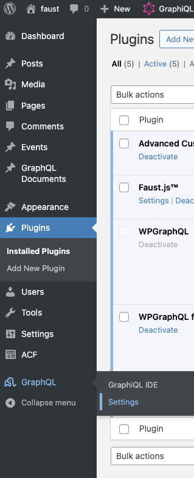
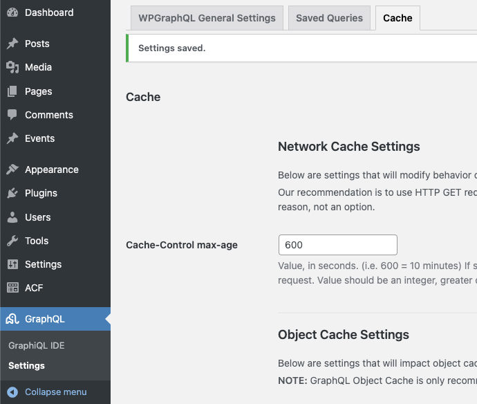
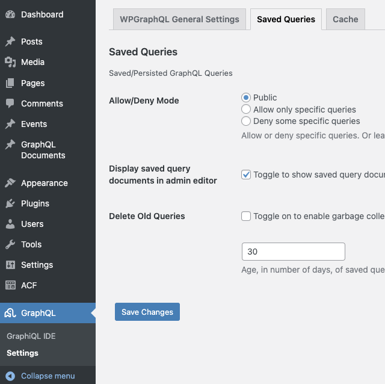
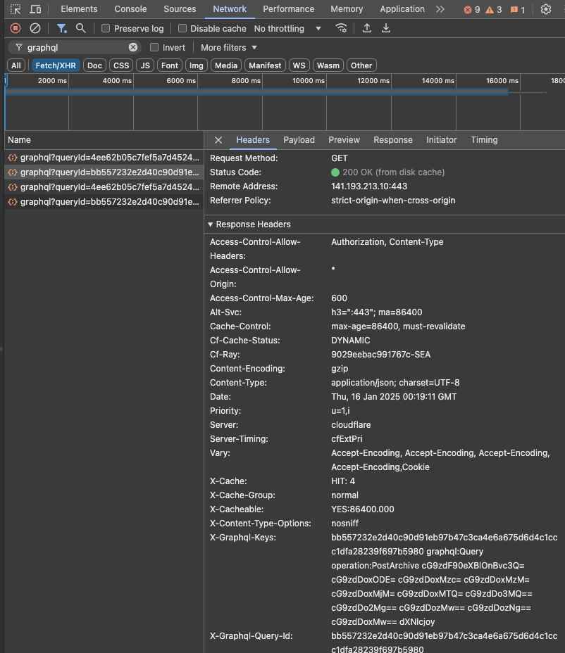
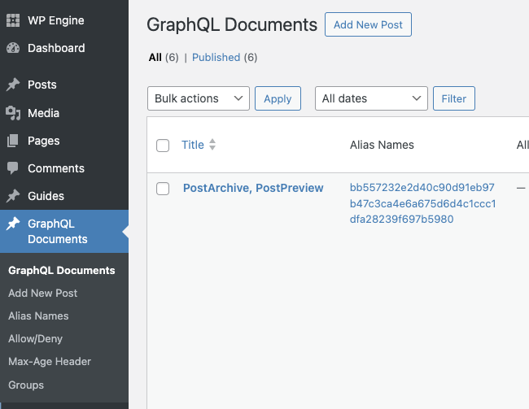

export const metadata = {
	title: "Using WPGraphQL Smart Cache Network Caching",
	description:
		"Guide to optimizing GraphQL queries using WPGraphQL Smart Cache with Faust.js built-in network caching support.",
};

WPGraphQL Smart Cache optimizes GraphQL queries by caching the results of your requests and automatically evicting outdated data whenever your WordPress content changes. Faust.js provides built-in support for [Network Caching](https://github.com/wp-graphql/wp-graphql-smart-cache/blob/main/docs/network-cache.md). This guide walks you through enabling Automatic Persisted Queries, using GET methods for network requests, and making one-off requests that override your default settings.

[!WARNING] Object Cache
WPGraphQL Smart Cache probides options for an [Object Cache](https://github.com/wp-graphql/wp-graphql-smart-cache/blob/main/docs/object-cache.md) based strategy as opossed to the network caching suggested here. Object caching is not recommended in combination with the Network Caching feature. However, you may use the Object Caching feature if you're on an [unsupported hosting provider](https://github.com/wp-graphql/wp-graphql-smart-cache/blob/main/docs/object-cache.md).

## 0. Prerequisites

If you haven't already, follow the [Basic Setup](/docs/how-to/basic-setup/) to get Faust.js set up.

## 1. Install WPGraphQL Smart Cache

Navigate to your WP Admin to install install and activate the [WPGraphQL Smart Cache](https://wordpress.org/plugins/wpgraphql-smart-cache/) plugin on your WordPress site.

## 2. Configure WPGraphQL Smart Cache

### A. Navigate to WPGraphQL Settings

Navigate to the WPGraphQL Settings from the left hand menu.



You will notice new "**_Cache_**" and "**_Saved Queries_**" tabs in the setting for WPGraphQL.

### B. Configure Network Caching

Navigate to the "**_Cache_**" tab and set the "Cache-Control max-age" for the "**_Network Cache_**" option. For this example we'll use 600 seconds.

> [!INFO]
> Smart Cache uses tag based cache invalidation. This means that when a post is updated, all queries that include that post will be invalidated. This is a powerful feature that allows for very granular cache invalidation. This is why we can set the cache time to a higher value than we would with a traditional cache. This TTL is the maximum time a query will be cached. If a post is updated, the cache will be invalidated without regard wo this value and the next request will be uncached.



### C. Configure Saved Queries

Navigate to the "**_Saved Queries_**" tab and select the box to "Display saved query documents in admin editor" and confirm "Allow/Deny Mode" is set to public.

> [!WARNING] Beware of Public Mode
> Setting the Allow/Deny Mode to "Public" will allow anyone to create saved queries. While this allows for Automatic Persisted Queries over manually defining them it does leave potential for abuse by outside actors. Unless this is actively being abused on your server, there's likely no need for concern.
>
> If you are concerned about this abuse, you can adjust these global settings or set "Allow/Deny" on a per query basis. See the [Persisted Query docs](https://github.com/wp-graphql/wp-graphql-smart-cache/blob/main/docs/persisted-queries.md) for more information.



## 3. Enabling Automatic Persisted Queries in Faust.js

Automatic Persisted queries send a hash of your GraphQL request to the server rather than sending the entire query string. This has a variety of benefits but in our case, we're using it to enable WPGraphQL Smart Cache's Network Caching feature.

Open your `faust.config.js` file and set `usePersistedQueries: true`:

```js {12} title="faust.config.js"
import { setConfig } from "@faustwp/core";
import templates from "./wp-templates";
import possibleTypes from "./possibleTypes.json";

/**
 * @type {import('@faustwp/core').FaustConfig}
 **/
export default setConfig({
	templates,s
	plugins: [],
	possibleTypes,
	usePersistedQueries: true,
});
```

## 4. Making Network Requests

Start up your development server and navigate to a page that uses GraphQL queries. If you check the "Network tab of your Developer Tools in browser you should see the network requests being made with the `GET` method.



## 5. Seeing your Persisted Queries

Finally, let's go checkout our persisted queries! Selct the "GraphQL Documents" option from the left hand menu in your WP Admin. You should see any queries that have been made by your site. As you add and modify queries, you'll see them appear here.


