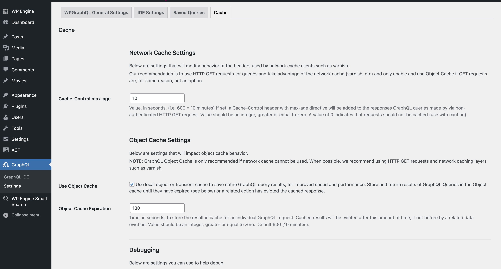

export const metadata = {
	title: "Using WPGraphQL Smart Cache",
};

WPGraphQL Smart Cache optimizes GraphQL queries by caching the results of your requests and automatically evicting outdated data whenever your WordPress content changes. Faust.js provides built-in support for persisted queries (which are required by WPGraphQL Smart Cache for advanced caching capabilities). This guide walks you through enabling and configuring persisted queries, using GET or POST methods for network requests, and making one-off requests that override your default settings.

## Steps

### 1\. Basic setup

If you haven't already, follow the [Basic Setup](/docs/how-to/basic-setup/) to get Faust.js set up.

### 2\. Install and Configure WPGraphQL Smart Cache

Navigate to your WP Admin and install the [WPGraphQL Smart Cache](https://wordpress.org/plugins/wpgraphql-smart-cache/) plugin on your WordPress site. Once installed, activate it and you will notice a WPGraphQL "**_Cache_**" tab in the menu setting of WPGraphQL:



### 3\. Enabling Persisted Queries in Faust.js

Persisted queries send a hash of your GraphQL request to the server rather than sending the entire query string. This is especially useful if you have large queries or frequently reused queries.

Open your `faust.config.js` file and set `usePersistedQueries: true`:

```js {12} title="faust.config.js"
import { setConfig } from "@faustwp/core";
import templates from "./wp-templates";
import possibleTypes from "./possibleTypes.json";

/**
 * @type {import('@faustwp/core').FaustConfig}
 **/
export default setConfig({
	templates,
	plugins: [],
	possibleTypes,
	usePersistedQueries: true,
});
```

> **NOTE**  
> If you are using `usePersistedQueries`, you cannot use `GET` unless WPGraphQL Smart Cache is installed.  
> WPGraphQL Smart Cache is required for persisted queries + the `GET` method.

If you want to display the admin UI for saved queries, you can do so by checking off a box in the settings for Smart Cache. Please reference the [smart cache docs](https://github.com/wp-graphql/wp-graphql-smart-cache/blob/main/docs/persisted-queries.md) for further extended instructions on this.

### 4\. Choose the Default HTTP Method (GET or POST)

By default, Faust 0.3.0 and above uses `GET` for GraphQL requests. You may want to switch to `POST` when:

- You are receiving stale data from cached `GET` responses.

- Your GraphQL queries are too large to fit in the URL (some hosting providers have strict URL length limits).

To force Faust to use `POST` by default, set `useGETForQueries` to `false`:

```js {12} title="faust.config.js"
import { setConfig } from "@faustwp/core";
import templates from "./wp-templates";
import possibleTypes from "./possibleTypes.json";

/**
 * @type {import('@faustwp/core').FaustConfig}
 **/
export default setConfig({
	templates,
	plugins: [],
	possibleTypes,
	useGETForQueries: false,
});
```

### 5\. Making One-Off Requests That Override Your Default Method

If you normally use `GET` but want a single request to use `POST`, you can override the method in the Apollo `useQuery` hook:

```js {4}
const { data, loading, error } = useQuery(MY_QUERY, {
	context: {
		fetchOptions: {
			method: "POST",
		},
	},
});
```

Conversely, if you normally use `POST` and need to do a single `GET`, you can set `method: "GET"` in the same way.
