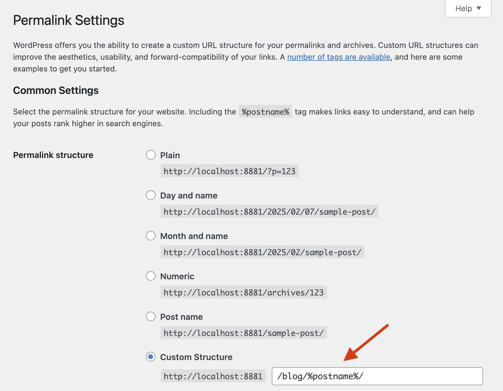
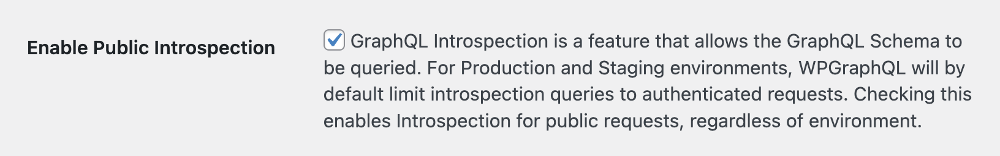
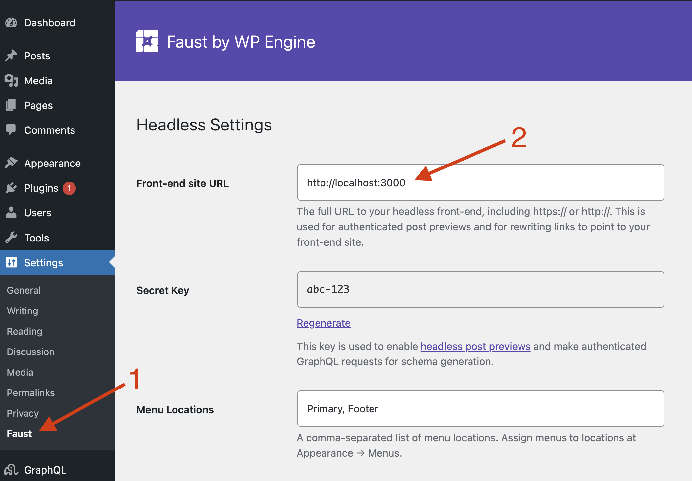
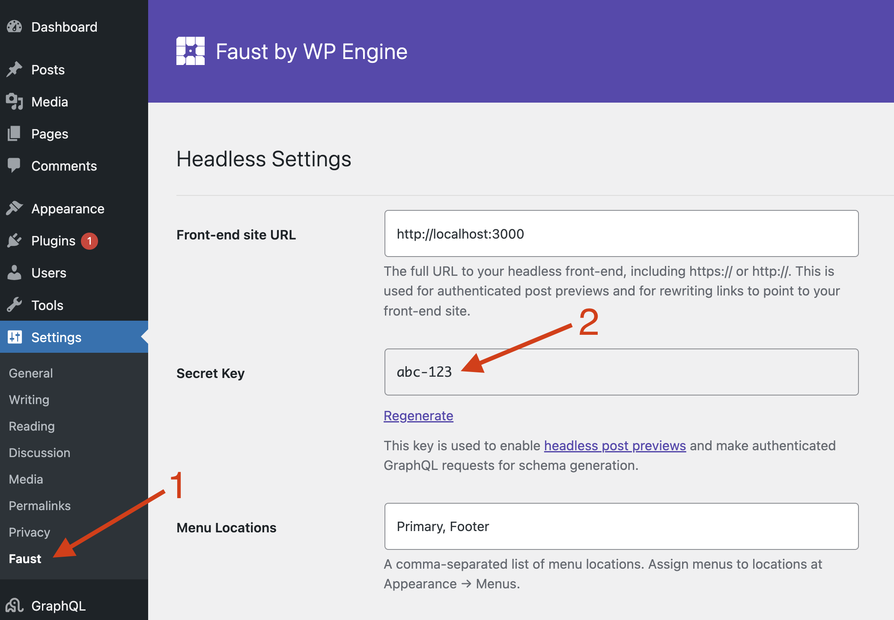
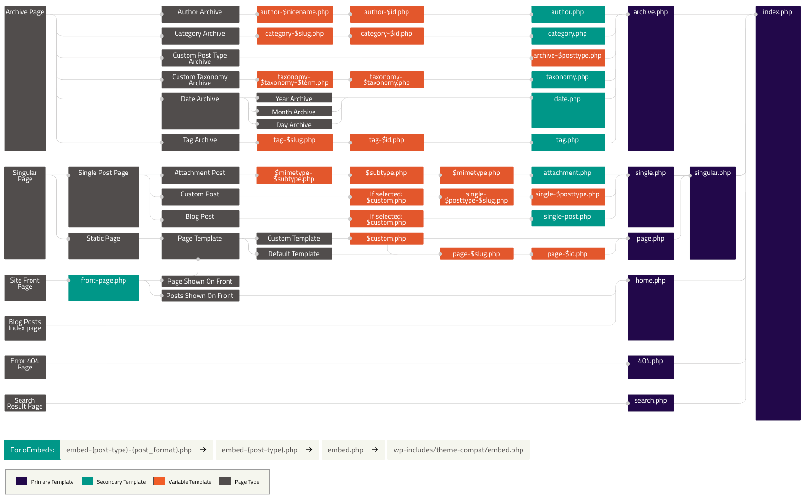
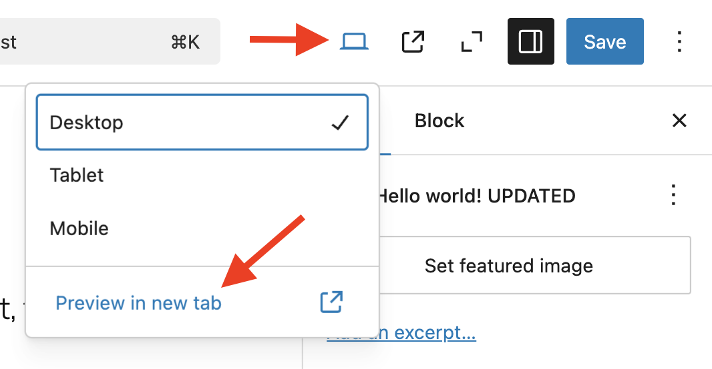
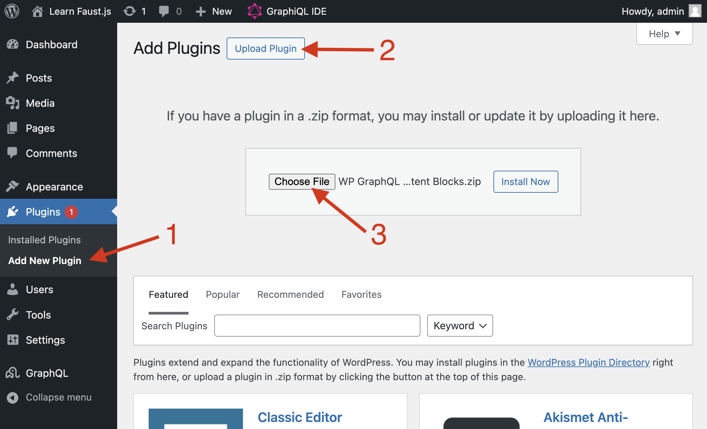

export const metadata = {
	title: "Learn Faust.js",
	description: "Tutorial to learn about the core features of Faust.js.",
};

This tutorial introduces you to the core features of Faust.js. You'll begin with a pre-configured Next.js project and learn how to implement these features yourself:

- [Template Hierarchy](#template-hierarchy)
- [Authentication & Post previews](#authentication--post-previews)
- [Blocks](#blocks)

By the end of this tutorial, you'll be able to configure your Next.js app and apply your newfound knowledge to integrate Faust.js features into your own projects.

## Prerequisites

In order to complete this tutorial, you should:

- Be familiar with HTML, CSS, JavaScript, [WordPress](https://wordpress.org/), [React](https://react.dev/), and [Next.js](https://nextjs.org/)
- Be familiar with [cloning a repository from GitHub](https://docs.github.com/en/repositories/creating-and-managing-repositories/cloning-a-repository)
- Be comfortable running commands on the [command line](https://en.wikipedia.org/wiki/Command-line_interface)
- Have [Node.js and NPM](https://nodejs.org/) installed on your computer

You should also not have any other projects running on port `3000` or `8881`, since the links in this tutorial point to pages on those ports.

## Set up

The steps below will get you up-and-running with the pre-built app you will use for the tutorial.

### 1. Install the Next.js app

- Run the command below to set up the example Next.js app we will use for the tutorial.

```sh
npx create-next-app \
    -e https://github.com/wpengine/faustjs/tree/canary \
    --example-path examples/next/tutorial \
    --use-npm
```

- When asked for the name of your project, enter `faust-tutorial`.
- When asked if it's okay to install the `create-next-app` package, answer `y` to confirm.

### 2. Set up headless WordPress backend

Initial set up steps:

- `cd` into the `/faust-tutorial` project folder.
- Run `npm run wp-dev`. This command uses the [`wp-now`](https://www.npmjs.com/package/@wp-now/wp-now) NPM package and the included `faust-tutorial-blueprint.json` blueprint file to set up a local WordPress environment.
- When asked if it's okay to install the `@wp-now/wp-now` package, answer `y` to confirm.

After a moment, you should have a WordPress site up-and-running.

By navigating to http://localhost:8881/wp-admin/plugins.php, You can see that the required [FaustWP](https://wordpress.org/plugins/faustwp/) and [WPGraphQL](https://wordpress.org/plugins/wp-graphql/) plugins have already been installed for you.

Next, we'll just configure a few last things in WordPress.

- Activate the FaustWP and WPGraphQL plugins.
- In the WordPress admin sidebar, go to `Settings` > `Permalinks`. Check the radio button for `Custom Structure`, enter `/blog/%postname%/` in the text field, and save your changes. With this setting, our blog posts will have URLs such as http://localhost:3000/blog/hello-world/.
  
- Head to `GraphQL` > `Settings`. Check the box for `Enable Public Introspection` and click the save button. This allows Faust.js to run an "introspection query" on your WordPress backend to get a list of the available GraphQL types and fields.
  
- Finally, head to to `Settings` > `Faust` to access the Faust.js settings page. Set the `Front-end site URL` setting to `http://localhost:3000` and save your changes. This lets Faust know the URL for your decoupled frontend app, which we'll set up next.
  

### 3. Set up Faust.js frontend

Follow these steps to set up your Faust.js frontend:

- Open a separate terminal window from the one running your WordPress backend to run the commands that follow.
- Run `npm install` to install the Next.js app's NPM packages.
- In a separate terminal window from the one running your WordPress backend, run `npm install` to install the Next.js app's NPM packages.
- Find the `.env.local.example` file and rename it to `.env.local`. This is where we'll store our environment variables.
- Once again, in the WordPress admin sidebar, go to `Settings` > `Faust` to access the Faust.js settings page. Copy the value you see for the `Secret Key` and paste that in as the value of `FAUST_SECRET_KEY` in your `.env.local` file and save it. Faust.js uses this secret key to send authenticated request to WordPress.
  
  

  

  Your `.env.local` file should now look like this, where `ABC123` is the secret key you copied from the Faust settings page:

```env title=".env.local"
# Your WordPress site URL
NEXT_PUBLIC_WORDPRESS_URL=http://localhost:8881

# Plugin secret found in WordPress Settings->Faust
FAUST_SECRET_KEY=ABC123
```

- Run `npm run generate` on the command line. Confirm that a `possibleTypes.json` has been generated in the `/faust-tutorial` project folder.
- Run `npm run dev` to start up your frontend app. You should now be able to visit http://localhost:3000 and see your app running.

## Template Hierarchy

WordPress is well-known for its [template hierarchy](https://developer.wordpress.org/themes/basics/template-hierarchy/) feature. It enables WordPress to dynamically select the most appropriate template for rendering a page based on its content type. Faust.js allows you to leverage the template hierarchy in your frontend app.

The following image is helpful for visualizing how WordPress' template hierarchy feature works. The logic starts on the left side of this flowchart and progresses to the right. A series of conditionals are run to determine the appropriate page template to use. Just disregard the ".php" file extensions you see, since templates in our headless WP project will be ".js" files instead.



Open the project in a code editor and find the `wp-templates` folder. This is the folder where you can place page template files you'd like to use. We've provided a `single.js` file for you. As you can see in the template hierarchy flowchart, the "single" page template is used to render single blog post pages. You can see this page template in action by viewing http://localhost:3000/blog/hello-world/. That page should display the contents for the "Hello world" blog post.

#### Add a template

Next, you'll learn how to create your own template. Let's add one for rendering single pages (the "Page" post type in WordPress).

By referencing the template hierarchy image above, you can see that we can target pages by adding a template named `page`. Inside of the `wp-templates` folder, add a new `page.js` file for our new template.

Copy the `gql` import and the `SingleTemplate` component from `wp-templates/single.js` and paste them into `wp-templates/page.js`. Rename the `SingleTemplate` component to `PageTemplate`. Our new page template should now look like this:

```jsx title="wp-templates/page.js"
import { gql } from "@apollo/client";

export default function PageTemplate(props) {
	const { title, content } = props.data.page;

	return (
		<>
			<h1>{title}</h1>
			<div dangerouslySetInnerHTML={{ __html: content }} />
		</>
	);
}
```

You can see that the `PageTemplate` component receives the props passed into it, destructures the `title` and `content` for the page, then renders them inside of the JSX the component returns.

Next, copy the `SingleTemplate.query` and `SingleTemplate.variables` assignments from `wp-templates/single.js` and paste them into `wp-templates/page.js`. rename them to `PageTemplate.query` and `PageTemplate.variables`. The new page template should now look like this:

```jsx title="wp-templates/page.js"
import { gql } from "@apollo/client";

export default function PageTemplate(props) {
	const { title, content } = props.data.page;

	return (
		<>
			<h1>{title}</h1>
			<div dangerouslySetInnerHTML={{ __html: content }} />
		</>
	);
}

PageTemplate.query = gql`
	query GetPage($uri: ID!) {
		page(id: $uri, idType: URI) {
			title
			content
		}
	}
`;

PageTemplate.variables = (seedQuery, ctx) => {
	return {
		uri: seedQuery?.uri,
	};
};
```

The `PageTemplate.variables` function takes the `uri` for the current page and makes that available as a variable that can be used in queries for the component's data.

`PageTemplate.query` is a `gql` [tagged template](https://developer.mozilla.org/en-US/docs/Web/JavaScript/Reference/Template_literals#tagged_templates) literal that specifies the data the component requires. In plain English, this query essentially says "hey WordPress: find the Page with this URI and give me back the title and post content for it". Once fetched, this data gets passed into the component inside of `props.data.page`.

The last step is to make Faust aware of our new template. To do this, open `wp-templates/index.js` and add these lines:

```js
import SingleTemplate from "./single";
import PageTemplate from "./page"; // [!code ++]

const templates = {
	single: SingleTemplate,
	page: PageTemplate, // [!code ++]
};

export default templates;
```

This tells Faust to use the `PageTemplate` component as the template to render pages that match `page`, according to the template hierarchy.

Save your changes and visit [http://localhost:3000/sample-page/](http://localhost:3000/sample-page/) in a browser. You should be able to see the title and content for the [Sample Page page in WordPress](http://localhost:8881/wp-admin/post.php?post=2&action=edit).

Now that you understand how to leverage the template hierarchy, you can follow this pattern to add additional page templates:

1. Create the template file inside of `/wp-templates`
2. Add the new template to the list of page templates in `/wp-templates/index.js`

You can reference the template hierarchy image above to determine which key to use for the `templates` object in `src/wp-templates/index.js`. This will result in Faust mapping the correct page template to the correct component.

## Authentication & Post previews

You now have page templates rendering your published WordPress Posts and Pages, which is cool! What about unpublished, _draft_ posts that content creators want to preview, though? Thankfully, Faust has you covered there, too!

In this section, we'll leverage Faust's built-in Authentication and Post Preview features to allow content creators to preview their draft blog posts. By authenticating the user, we'll know whether they have the permissions necessary to view a particular draft post. If they do, we'll handle rendering the draft blog post for them to preview.

The app is set up so that when Faust renders a page, it includes an additional `asPreview` prop that is set to `true` if a draft post is being rendered, else `false`. Let's learn how we can make use of that prop to render draft posts.

### 1. Update `single` template

Open your `wp-templates/single.js` template. Above the existing `return` statement, add the code below.

```jsx title="src/wp-templates/single.js"
if (props.loading) {
	return <p>Loading...</p>;
}
```

This tells React to render a "Loading" message if the component is still loading. This momentary data fetching delay occurs because draft blog posts are client-side rendered (CSR) rather than server-side rendered (SSR).

Update the `Component.variables` function to return a new `asPreview` variable that is set to the value of `ctx?.asPreview`:

```jsx title="src/wp-templates/single.js"
SingleTemplate.variables = ({ databaseId }, ctx) => {
	return {
		databaseId,
		asPreview: ctx?.asPreview, // [!code ++]
	};
};
```

Inside of the `GetPost` GraphQL query, accept a new `$asPreview: Boolean = false` argument. Pass that value into the `post` query by adding `asPreview: $asPreview`, as shown below.

```jsx title="src/wp-templates/single.js"
SingleTemplate.query = gql`
	query GetPost($uri: ID!, $asPreview: Boolean = false) {
		post(id: $uri, idType: URI, asPreview: $asPreview) {
			title
			content
		}
	}
`;
```

Your `single` template file should now look like this:

```jsx title="src/wp-templates/single.js"
import { gql } from "@apollo/client";

export default function SingleTemplate(props) {
	const { title, content } = props.data.post;

	if (props.loading) {
		return <p>Loading...</p>;
	}

	return (
		<>
			<h1>{title}</h1>
			<div dangerouslySetInnerHTML={{ __html: content }} />
		</>
	);
}

SingleTemplate.query = gql`
	query GetPost($uri: ID!, $asPreview: Boolean = false) {
		post(id: $uri, idType: URI, asPreview: $asPreview) {
			title
			content
		}
	}
`;

SingleTemplate.variables = (seedQuery, ctx) => {
	return {
		uri: seedQuery?.uri,
		asPreview: ctx?.asPreview,
	};
};
```

### 2. Preview a draft post

Let's try out our new post previews feature! In the WordPress admin sidebar, click the `Posts` link. Find the `Hello world!` blog post on the list and click it to edit that post. Make a small change to it, such as modifying the title or content.

Click the `View` icon, then click `Preview in new tab`.



This should send you to `http://localhost:3000/blog/hello-world` with a number of query string parameters attached. When this request is made, Faust authenticates you, confirms that you have the permissions necessary to preview the post, then finally renders the draft blog post.

After you complete the tutorial, you can read our how-to guides on [Authentication](/docs/how-to/authentication/) and [Post Previews](/docs/how-to/post-previews/) to learn more about these features.

## Blocks

Content creators use the Block Editor to write posts and pages in WordPress using blocks. In headless WordPress, it's possible to take the HTML for the entire page and insert it into the DOM in your decoupled front-end app. On most sites, though, it becomes necessary to map WordPress blocks to React components in your front-end app so you can control how individual blocks are rendered. Fortunately, we can leverage the [WPGraphQL Content Blocks](https://github.com/wpengine/wp-graphql-content-blocks) extension and the blocks functionality that comes with Faust.js to do just that. Let's learn how.

### 1. Install the WPGraphQL Content Blocks plugin

Head to the [Releases page of the WPGraphQL Content Blocks](https://github.com/wpengine/wp-graphql-content-blocks/releases) GitHub repository. Download the `wp-graphql-content-blocks.zip` file from the latest release.

In the WordPress admin, navigate to `Plugins` > `Add New` > `Upload`. Select the `wp-graphql-content-blocks.zip` file to install the plugin, then activate it.



This plugin exposes WordPress blocks data in the GraphQL schema so that we can query for it.

### 2. Query for blocks data

Next, we'll update our `single` blog post template to query for and render blocks. Currently, the `single` template does this:

1. Includes `content` in its GraphQL query to get the post content.
2. Uses `<div dangerouslySetInnerHTML={{ __html: content }} />` to render the content as a string of HTML.

Inside of the `SingleTemplate.query` GraphQL query, remove `content` and replace it with an `editorBlocks` section, as shown below.

```jsx title="src/wp-templates/single.js"
query GetPost($uri: ID!, $asPreview: Boolean = false) {
	post(id: $uri, idType: URI, asPreview: $asPreview) {
		title
		editorBlocks {
			__typename
			name
			renderedHtml
			... on CoreParagraph {
				attributes {
					className
				}
			}
		}
	}
}
```

Next we'll update the component to use this new data. Within the `SingleTemplate` component, remove `content` from the destructured post props and replace it with `editorBlocks`:

```jsx title="src/wp-templates/single.js"
const { title, editorBlocks } = props.data.post;
```

Finally, replace the `<div dangerouslySetInnerHTML={{ __html: content }} />` line with the code below.

```jsx title="src/wp-templates/single.js"
<div>
	{editorBlocks.map((block, index) => {
		if (block.name === "core/paragraph") {
			return (
				<div
					key={index}
					className="paragraph-block-wrapper"
					dangerouslySetInnerHTML={{ __html: block.renderedHtml }}
				/>
			);
		}
		return (
			<div
				key={index}
				dangerouslySetInnerHTML={{ __html: block.renderedHtml }}
			/>
		);
	})}
</div>
```

Your updated `SingleTemplate` component should now look like this:

```jsx title="src/wp-templates/single.js"
export default function SingleTemplate(props) {
	const { title, editorBlocks } = props.data.post;

	if (props.loading) {
		return <p>Loading...</p>;
	}

	return (
		<>
			<h1>{title}</h1>
			<div>
				{editorBlocks.map((block, index) => {
					console.log(block);
					if (block.name === "core/paragraph") {
						return (
							<div
								key={index}
								className="paragraph-block-wrapper"
								dangerouslySetInnerHTML={{ __html: block.renderedHtml }}
							/>
						);
					}
					return (
						<div
							key={index}
							dangerouslySetInnerHTML={{ __html: block.renderedHtml }}
						/>
					);
				})}
			</div>
		</>
	);
}
```

You should now be able to visit http://localhost:3000/blog/hello-world/ and see the "Hello World" blog post's blocks content being rendered.

Inspect the blog post content in the browser dev tools and notice that each block is being rendered and that only the paragraph blocks are wrapped in a `div` with a class name of `paragraph-block-wrapper`. Currently, we're not leveraging the `paragraph-block-wrapper` class in any way, but you can see the potential here. By being able to query for and render blocks individually, you have the ability to wrap specific blocks in arbitrary markup, override specific blocks with custom implementations, and more.

Now [edit the Hello World! blog post](http://localhost:8881/wp-admin/post.php?post=1&action=edit). Make several changes to it in terms of font size, padding, margin, a border, an HTML anchor, and additional CSS classes, then save your changes.

Reload the http://localhost:3000/blog/hello-world/ page in your frontend app and see that all the changes you applied are now being reflected. Inspect the paragraph block in DevTools to see markup similar to the example below. You can see that Faust has taken care of rendering the paragraph tag to include these attributes, and even loaded the CSS required to apply the correct styles.

```html
<div class="paragraph-block-wrapper">
	<p
		class="is-style-text-annotation has-large-font-size is-style-text-annotation--1"
		id="anchors-away"
		style="
      border-width: 4px;
      padding-top: var(--wp--preset--spacing--20);
      padding-right: var(--wp--preset--spacing--40);
      padding-bottom: var(--wp--preset--spacing--20);
      padding-left: var(--wp--preset--spacing--40);
    "
	>
		Welcome to WordPress. This is your first post. Edit or delete it, then start
		writing!
	</p>
</div>
```

More information about using Faust to render blocks, override WordPress core blocks with your own implementation, and even add support for custom blocks can be found in these how-to guides:

- [Rendering Blocks](/docs/how-to/rendering-blocks/)
- [Override Blocks](/docs/how-to/override-blocks/)
- [Custom Blocks](/docs/how-to/custom-blocks/)

## Next steps

Thanks for completing this tutorial to learn about the core features of Faust.js! You should now have a basic understanding of the Template hierarchy, Authentication & Post previews, and Blocks functionality that it provides.

You can review the rest of our documentation to learn how to add Faust to your headless WordPress + Next.js project and learn about Faust's features in more depth.
